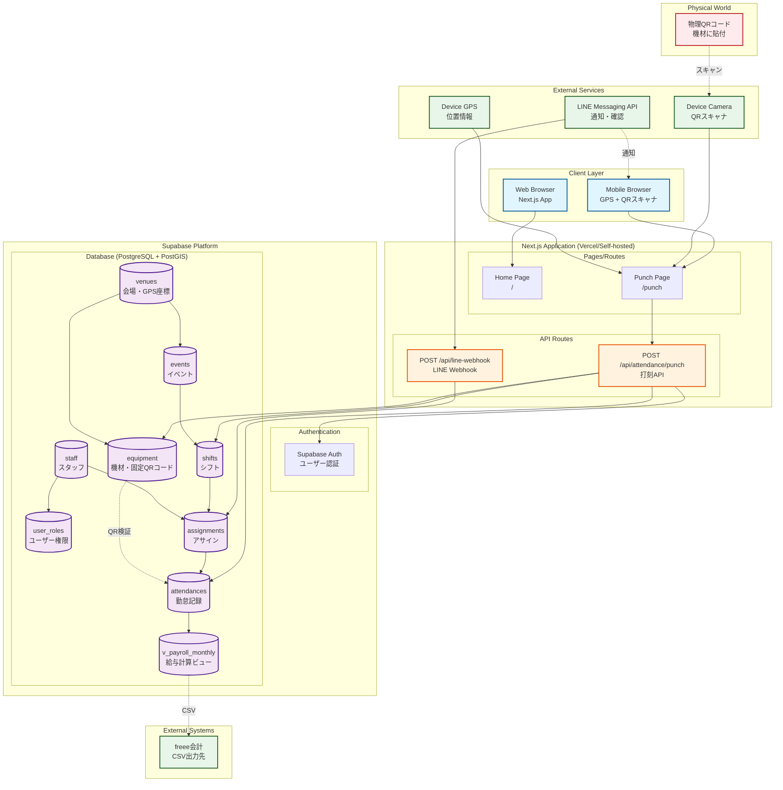
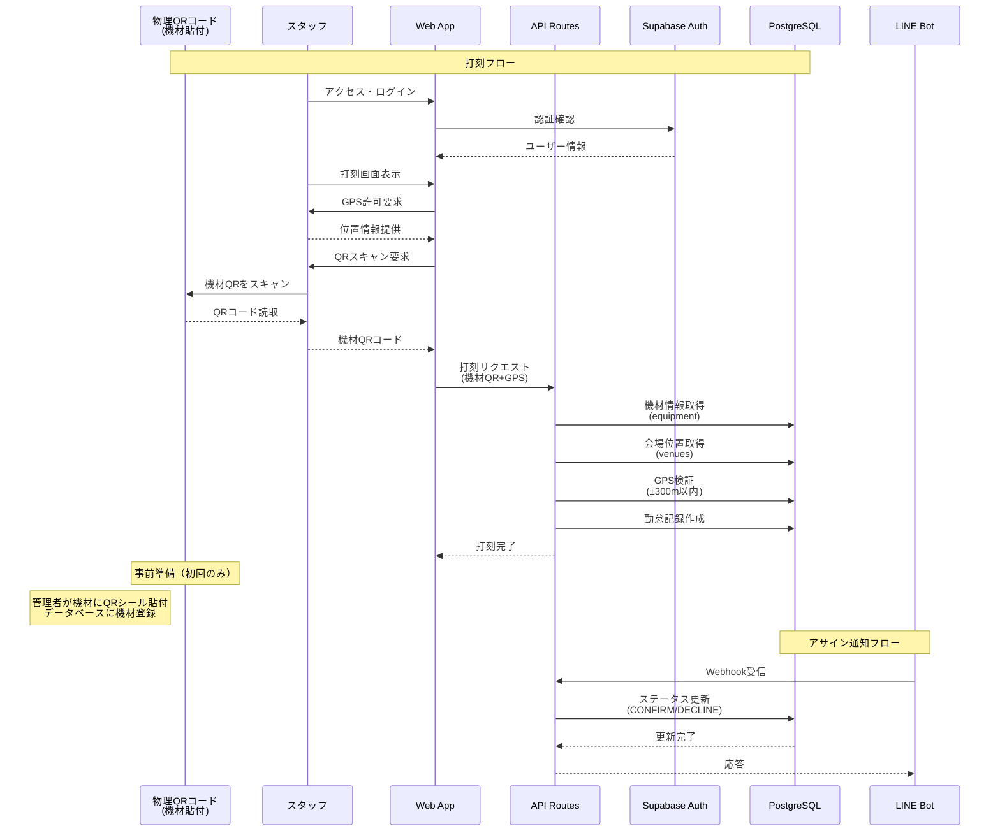

# システムアーキテクチャ

## 全体構成図

## データフロー図

## アーキテクチャの主要な特徴

### 1. 3層アーキテクチャ
- **Client Layer**: Web/Mobileブラウザからのアクセス
- **Application Layer**: Next.js (App Router) による処理
- **Data Layer**: Supabase (PostgreSQL + PostGIS)

### 2. 認証・セキュリティ
- **2要素認証打刻**: GPS位置情報 + QRコード
- **位置検証**: PostGISによる±300m範囲内チェック
- **LINE Webhook**: HMAC署名による検証
- **環境変数分離**: Public/Server-only キーの明確な分離

### 3. 主要コンポーネント

#### Frontend (Next.js App Router)
- `/`: ホームページ
- `/punch`: 打刻ページ（GPS/QR対応）

#### API Routes
- `/api/attendance/punch`: 打刻処理エンドポイント
- `/api/line-webhook`: LINE Bot連携用Webhook

#### Supabase Services
- **Authentication**: ユーザー認証管理
- **Database**: PostgreSQL + PostGIS拡張
- **Edge Functions**: QRコード生成（Denoランタイム）

#### データベーステーブル
- `venues`: 会場情報（GPS座標含む）
- `events`: イベント情報
- `shifts`: シフト情報（lighting/rigging）
- `staff`: スタッフ情報
- `assignments`: スタッフアサイン
- `attendances`: 勤怠記録
- `qr_tokens`: QR認証トークン
- `v_payroll_monthly`: 給与計算用ビュー

### 4. 外部連携
- **LINE Messaging API**: スタッフへの通知・確認
- **freee会計**: CSV形式での給与データ出力

### 5. 技術スタック
- **Frontend**: Next.js 14, React 18, TypeScript, Tailwind CSS
- **Backend**: Supabase (PostgreSQL, PostGIS, Edge Functions)
- **認証**: Supabase Auth
- **検証**: Zod (スキーマバリデーション)
- **地理情報**: PostGIS (地理空間データ処理)