# HAAS (HKT Assign & Attendance System) アーキテクチャ

## システム概要

HAAS（ハース）は、イベント制作現場における照明・リギングスタッフの勤怠管理と作業管理を統合したWebアプリケーションです。GPS位置情報とQRコード認証を組み合わせた厳密な勤怠管理により、正確な労務管理を実現します。

### デプロイメント状況
- **Production URL**: https://haas-nu.vercel.app/
- **ホスティング**: Vercel (自動デプロイ設定済み)
- **バックエンド**: Supabase Cloud

## 全体構成図

```mermaid
graph TB
    subgraph "Client Layer"
        WEB[Web Browser<br/>Next.js App]
        MOBILE[Mobile Browser<br/>GPS + QRスキャナ]
    end

    subgraph "Next.js Application (Vercel/Self-hosted)"
        subgraph "Pages/Routes"
            HOME[Home Page<br/>/]
            PUNCH[Punch Page<br/>/punch]
            ADMIN[Admin Page<br/>/admin]
            ASSIGN[Assign Page<br/>/admin/assign]
            LOGIN[Login Page<br/>/login]
            DEBUG[Debug Page<br/>/debug]
        end
        
        subgraph "API Routes"
            API_PUNCH[POST /api/attendance/punch<br/>打刻API]
            API_SLACK[POST /api/slack-webhook<br/>Slack Webhook]
            API_AUTH[/api/auth/*<br/>認証API]
            API_ADMIN[/api/admin/*<br/>管理API]
        end
    end

    subgraph "External Services"
        SLACK[Slack API<br/>通知・確認]
        QR_SCANNER[Device Camera<br/>QRスキャナ]
        GPS[Device GPS<br/>位置情報]
    end

    subgraph "Supabase Platform"
        subgraph "Authentication"
            AUTH[Supabase Auth<br/>ユーザー認証]
        end
        
        subgraph "Database (PostgreSQL + PostGIS)"
            DB_VENUES[(venues<br/>会場・GPS座標)]
            DB_EQUIPMENT[(equipment<br/>機材・固定QRコード)]
            DB_EVENTS[(events<br/>イベント)]
            DB_SHIFTS[(shifts<br/>シフト)]
            DB_STAFF[(staff<br/>スタッフ)]
            DB_USER_ROLES[(user_roles<br/>ユーザー権限)]
            DB_ASSIGN[(assignments<br/>アサイン)]
            DB_ATTEND[(attendances<br/>勤怠記録)]
            DB_VIEW[(v_payroll_monthly<br/>給与計算ビュー)]
        end
    end

    subgraph "External Systems"
        FREEE[freee会計<br/>CSV出力先]
    end

    subgraph "Physical World"
        PHYSICAL_QR[物理QRコード<br/>機材に貼付]
    end

    %% Client interactions
    WEB --> HOME
    MOBILE --> PUNCH
    QR_SCANNER --> PUNCH
    GPS --> PUNCH
    PHYSICAL_QR -.スキャン.-> QR_SCANNER

    %% API flows
    PUNCH --> API_PUNCH
    API_PUNCH --> AUTH
    API_PUNCH --> DB_EQUIPMENT
    API_PUNCH --> DB_ATTEND
    API_PUNCH --> DB_SHIFTS

    %% Slack integration
    SLACK --> API_SLACK
    API_SLACK --> DB_ASSIGN
    SLACK -.通知.-> MOBILE

    %% Database relationships
    DB_VENUES --> DB_EQUIPMENT
    DB_VENUES --> DB_EVENTS
    DB_EVENTS --> DB_SHIFTS
    DB_SHIFTS --> DB_ASSIGN
    DB_STAFF --> DB_ASSIGN
    DB_STAFF --> DB_USER_ROLES
    DB_ASSIGN --> DB_ATTEND
    DB_EQUIPMENT -.QR検証.-> DB_ATTEND
    DB_ATTEND --> DB_VIEW
    
    %% Export
    DB_VIEW -.CSV.-> FREEE

    %% Styling
    classDef client fill:#e1f5fe,stroke:#01579b,stroke-width:2px
    classDef api fill:#fff3e0,stroke:#e65100,stroke-width:2px
    classDef db fill:#f3e5f5,stroke:#4a148c,stroke-width:2px
    classDef external fill:#e8f5e9,stroke:#1b5e20,stroke-width:2px
    classDef physical fill:#ffebee,stroke:#b71c1c,stroke-width:2px
    
    class WEB,MOBILE client
    class API_PUNCH,API_SLACK api
    class DB_VENUES,DB_EQUIPMENT,DB_EVENTS,DB_SHIFTS,DB_STAFF,DB_USER_ROLES,DB_ASSIGN,DB_ATTEND,DB_VIEW db
    class SLACK,QR_SCANNER,GPS,FREEE external
    class PHYSICAL_QR physical
```

## データフロー図

```mermaid
sequenceDiagram
    participant PQR as 物理QRコード<br/>(機材貼付)
    participant S as スタッフ
    participant W as Web App
    participant API as API Routes
    participant AUTH as Supabase Auth
    participant DB as PostgreSQL
    participant SLACK as Slack Bot

    Note over PQR,DB: 打刻フロー
    S->>W: アクセス・ログイン
    W->>AUTH: 認証確認
    AUTH-->>W: ユーザー情報
    
    S->>W: 打刻画面表示
    W->>S: GPS許可要求
    S-->>W: 位置情報提供
    
    W->>S: QRスキャン要求
    S->>PQR: 機材QRをスキャン
    PQR-->>S: QRコード読取
    S-->>W: 機材QRコード
    
    W->>API: 打刻リクエスト<br/>(機材QR+GPS)
    API->>DB: 機材情報取得<br/>(equipment)
    API->>DB: 会場位置取得<br/>(venues)
    API->>DB: GPS検証<br/>(±300m以内)
    API->>DB: 勤怠記録作成
    API-->>W: 打刻完了
    
    Note over PQR: 事前準備（初回のみ）
    Note left of PQR: 管理者が機材にQRシール貼付<br/>データベースに機材登録

    Note over SLACK,DB: アサイン通知フロー
    SLACK->>API: Webhook受信
    API->>DB: ステータス更新<br/>(承認/辞退)
    DB-->>API: 更新完了
    API-->>SLACK: 応答
```



## アーキテクチャの主要な特徴

### 1. 3層アーキテクチャ
- **Client Layer**: Web/Mobileブラウザからのアクセス
- **Application Layer**: Next.js (App Router) による処理
- **Data Layer**: Supabase (PostgreSQL + PostGIS)

### 2. 認証・セキュリティ
- **2要素認証打刻**: GPS位置情報 + QRコード
- **位置検証**: PostGISによる±300m範囲内チェック
- **Slack Webhook**: Signing Secretによる検証
- **環境変数分離**: Public/Server-only キーの明確な分離

### 3. 主要コンポーネント

#### Frontend (Next.js App Router)
- `/`: ホームページ
- `/punch`: 打刻ページ（GPS/QR対応）

#### API Routes
- `/api/attendance/punch`: 打刻処理エンドポイント
- `/api/slack-webhook`: Slack Bot連携用Webhook

#### Supabase Services
- **Authentication**: ユーザー認証管理
- **Database**: PostgreSQL + PostGIS拡張
- **Edge Functions**: QRコード生成（Denoランタイム）

#### データベーステーブル
- `venues`: 会場情報（GPS座標含む）
- `events`: イベント情報
- `shifts`: シフト情報（lighting/rigging）
- `staff`: スタッフ情報
- `assignments`: スタッフアサイン
- `attendances`: 勤怠記録
- `qr_tokens`: QR認証トークン
- `v_payroll_monthly`: 給与計算用ビュー

### 4. 外部連携
- **Slack API**: スタッフへの通知・確認
- **freee会計**: CSV形式での給与データ出力（v_payroll_monthly ビュー経由）

### 5. 技術スタック
- **Frontend**: Next.js 14.2, React 18, TypeScript, Tailwind CSS
- **Backend**: Supabase (PostgreSQL, PostGIS, Edge Functions)
- **認証**: Supabase Auth (JWT)
- **検証**: Zod (スキーマバリデーション)
- **地理情報**: PostGIS (地理空間データ処理)
- **デプロイ**: Vercel (CI/CD自動化)
- **バージョン管理**: GitHub

### 6. 環境変数構成
```
NEXT_PUBLIC_SUPABASE_URL        # Supabase プロジェクトURL
NEXT_PUBLIC_SUPABASE_ANON_KEY   # 公開用匿名キー
SUPABASE_SERVICE_ROLE_KEY       # サーバー側管理キー
SLACK_SIGNING_SECRET             # Slack Signing Secret
SLACK_BOT_TOKEN                  # Slack Bot Token
SLACK_CHANNEL_ID                 # 通知送信先チャンネル
APP_BASE_URL                     # https://haas-nu.vercel.app
```

### 7. GPS位置情報の実装詳細
- **精度設定**: enableHighAccuracy: true
- **タイムアウト**: 30秒
- **許可範囲**: 会場から半径300m以内
- **ブラウザ対応**:
  - iOS: Safari/Chrome（要位置情報許可）
  - Android: Chrome/Firefox
- **HTTPS必須**: localhost以外はHTTPS必須

### 8. 現在の実装状況
#### 実装済み機能
- ✅ スタッフ認証・ログイン
- ✅ GPS打刻機能（会場から300m以内の位置検証）
- ✅ QRコード認証（機材QRコードスキャン）
- ✅ 管理画面（シフト一覧）
- ✅ スタッフアサイン機能
- ✅ Vercel自動デプロイ
- ✅ 2要素認証打刻（GPS + QRコード）

#### 開発中/予定
- 🚧 写真撮影機能（DBスキーマ準備済み、API未実装）
- 🚧 Slack通知実装
- 🚧 freee API連携
- 📋 LIFF統合
- 📋 レポート機能