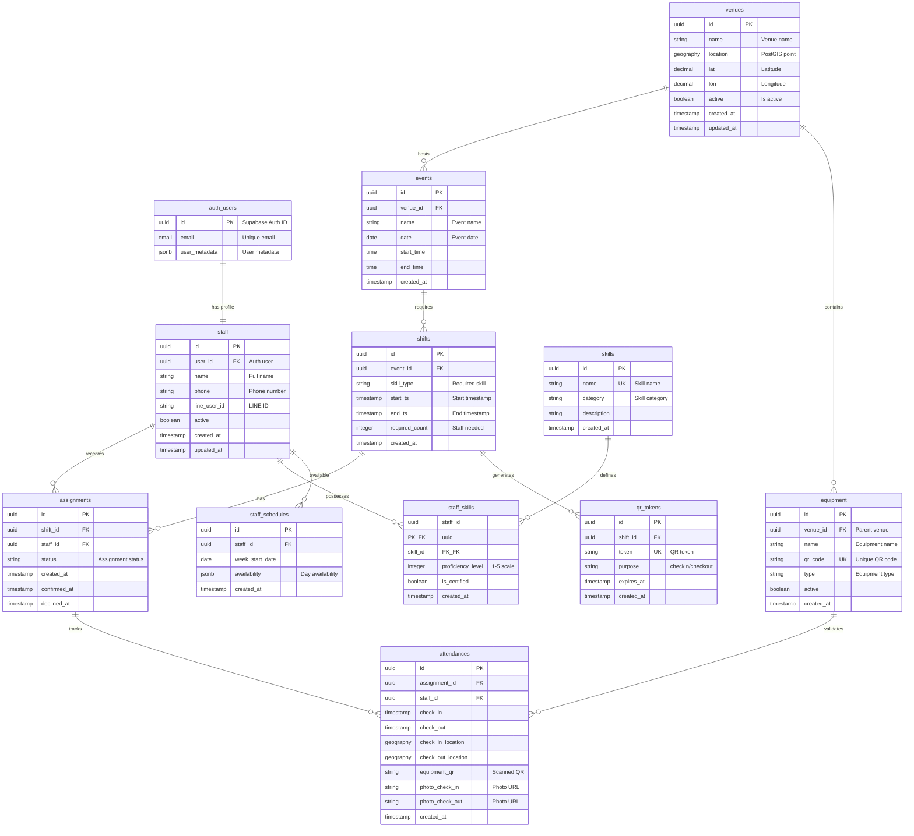

# HAAS データベーススキーマドキュメント
# HKT48劇場 スタッフアサイン＆勤怠システム - データベース設計

## 目次
1. [概要](#概要)
2. [データベース構造](#データベース構造)
3. [コアテーブル](#コアテーブル)
4. [結合テーブル](#結合テーブル)
5. [ビュー](#ビュー)
6. [関数とプロシージャ](#関数とプロシージャ)
7. [行レベルセキュリティ-rls](#行レベルセキュリティ-rls)
8. [インデックスとパフォーマンス](#インデックスとパフォーマンス)
9. [マイグレーション履歴](#マイグレーション履歴)

## 概要

HAASデータベースは、地理データ処理のPostGIS拡張付きPostgreSQL 15+を使用しています。データベースはSupabase Cloudでホストされ、自動バックアップとポイントインタイムリカバリが備わっています。

### 主要機能
- **PostGIS拡張**: 地理データ型と空間クエリ
- **行レベルセキュリティ**: データベースレベルアクセス制御
- **UUID主キー**: グローバル唯一識別子
- **ソフト削除**: ハード削除の代わりにアクティブフラグ
- **監査記録**: すべてのテーブルでタイムスタンプ追跡

### データベース仕様
- **エンジン**: PostgreSQL 15.1
- **拡張**: uuid-ossp, postgis, pg_cron
- **タイムゾーン**: Asia/Tokyo (JST)
- **エンコーディング**: UTF8
- **照合順序**: ja_JP.UTF-8

## データベース構造

### エンティティ関係図



## コアテーブル

### venues
GPS座標を含む会場/位置情報を保存

```sql
CREATE TABLE public.venues (
    id UUID PRIMARY KEY DEFAULT uuid_generate_v4(),
    name VARCHAR(255) NOT NULL,
    address TEXT,
    lat DECIMAL(10, 7) NOT NULL,  -- Latitude
    lon DECIMAL(10, 7) NOT NULL,  -- Longitude
    location GEOGRAPHY(POINT, 4326),  -- PostGIS point
    active BOOLEAN DEFAULT true,
    created_at TIMESTAMP WITH TIME ZONE DEFAULT now(),
    updated_at TIMESTAMP WITH TIME ZONE DEFAULT now()
);

-- Example data
INSERT INTO venues (name, lat, lon, location) VALUES
('HKT48劇場', 33.5904, 130.4017, ST_MakePoint(130.4017, 33.5904)::geography);
```

### events
会場にリンクされたイベント情報

```sql
CREATE TABLE public.events (
    id UUID PRIMARY KEY DEFAULT uuid_generate_v4(),
    venue_id UUID NOT NULL REFERENCES venues(id),
    name VARCHAR(255) NOT NULL,
    date DATE NOT NULL,
    start_time TIME NOT NULL,
    end_time TIME NOT NULL,
    created_at TIMESTAMP WITH TIME ZONE DEFAULT now(),

    CONSTRAINT events_venue_fk FOREIGN KEY (venue_id)
        REFERENCES venues(id) ON DELETE CASCADE
);

-- Indexes
CREATE INDEX idx_events_date ON events(date);
CREATE INDEX idx_events_venue_id ON events(venue_id);
```

### shifts
特定のスキルを持つスタッフが必要なワークシフト

```sql
CREATE TABLE public.shifts (
    id UUID PRIMARY KEY DEFAULT uuid_generate_v4(),
    event_id UUID NOT NULL REFERENCES events(id),
    skill_type VARCHAR(50) NOT NULL,  -- 'PA', 'Sound', 'Lighting', 'Backstage'
    start_ts TIMESTAMP WITH TIME ZONE NOT NULL,
    end_ts TIMESTAMP WITH TIME ZONE NOT NULL,
    required_count INTEGER NOT NULL DEFAULT 1,
    created_at TIMESTAMP WITH TIME ZONE DEFAULT now(),

    CHECK (end_ts > start_ts),
    CHECK (required_count > 0)
);

-- Indexes
CREATE INDEX idx_shifts_event_id ON shifts(event_id);
CREATE INDEX idx_shifts_start_ts ON shifts(start_ts);
```

### staff
認証ユーザーにリンクされたスタッフメンバープロフィール

```sql
CREATE TABLE public.staff (
    id UUID PRIMARY KEY DEFAULT uuid_generate_v4(),
    user_id UUID UNIQUE REFERENCES auth.users(id),
    name VARCHAR(255) NOT NULL,
    phone VARCHAR(20),
    line_user_id VARCHAR(100) UNIQUE,
    active BOOLEAN DEFAULT true,
    created_at TIMESTAMP WITH TIME ZONE DEFAULT now(),
    updated_at TIMESTAMP WITH TIME ZONE DEFAULT now()
);

-- RLS Policies (Simplified after fix)
ALTER TABLE public.staff ENABLE ROW LEVEL SECURITY;

CREATE POLICY "staff_select_all_simple" ON public.staff
    FOR SELECT TO authenticated
    USING (true);

CREATE POLICY "staff_update_self_simple" ON public.staff
    FOR UPDATE TO authenticated
    USING (user_id = auth.uid())
    WITH CHECK (user_id = auth.uid());
```

### skills
利用可能スキルのマスターリスト

```sql
CREATE TABLE public.skills (
    id UUID PRIMARY KEY DEFAULT uuid_generate_v4(),
    name VARCHAR(50) UNIQUE NOT NULL,
    category VARCHAR(50),
    description TEXT,
    created_at TIMESTAMP WITH TIME ZONE DEFAULT now()
);

-- 初期データ
INSERT INTO skills (name, category) VALUES
('PA', 'Technical'),
('sound_operator', 'Technical'),
('lighting', 'Technical'),
('backstage', 'Support');
```

### equipment
勤怠確認用QRコード付き機材

```sql
CREATE TABLE public.equipment (
    id UUID PRIMARY KEY DEFAULT uuid_generate_v4(),
    venue_id UUID NOT NULL REFERENCES venues(id),
    name VARCHAR(255) NOT NULL,
    qr_code VARCHAR(100) UNIQUE NOT NULL,
    type VARCHAR(50),  -- 'sound', 'lighting', 'general'
    active BOOLEAN DEFAULT true,
    created_at TIMESTAMP WITH TIME ZONE DEFAULT now()
);

-- Index for QR lookups
CREATE UNIQUE INDEX idx_equipment_qr_code ON equipment(qr_code);
```

### assignments
ステータス追跡付きでスタッフをシフトにリンク

```sql
CREATE TABLE public.assignments (
    id UUID PRIMARY KEY DEFAULT uuid_generate_v4(),
    shift_id UUID NOT NULL REFERENCES shifts(id),
    staff_id UUID NOT NULL REFERENCES staff(id),
    status VARCHAR(20) NOT NULL DEFAULT 'pending',
    -- Status values: 'pending', 'confirmed', 'declined', 'cancelled'
    created_at TIMESTAMP WITH TIME ZONE DEFAULT now(),
    confirmed_at TIMESTAMP WITH TIME ZONE,
    declined_at TIMESTAMP WITH TIME ZONE,

    UNIQUE(shift_id, staff_id),  -- Prevent duplicate assignments
    CHECK (status IN ('pending', 'confirmed', 'declined', 'cancelled'))
);

-- Indexes
CREATE INDEX idx_assignments_shift_id ON assignments(shift_id);
CREATE INDEX idx_assignments_staff_id ON assignments(staff_id);
CREATE INDEX idx_assignments_status ON assignments(status);
```

### attendances
GPS検証付きで実際のチェックイン/チェックアウトを追跡

```sql
CREATE TABLE public.attendances (
    id UUID PRIMARY KEY DEFAULT uuid_generate_v4(),
    assignment_id UUID REFERENCES assignments(id),
    staff_id UUID NOT NULL REFERENCES staff(id),
    shift_id UUID NOT NULL REFERENCES shifts(id),
    check_in TIMESTAMP WITH TIME ZONE,
    check_out TIMESTAMP WITH TIME ZONE,
    check_in_location GEOGRAPHY(POINT, 4326),
    check_out_location GEOGRAPHY(POINT, 4326),
    equipment_qr VARCHAR(100),
    photo_check_in TEXT,  -- Storage URL
    photo_check_out TEXT,  -- Storage URL
    created_at TIMESTAMP WITH TIME ZONE DEFAULT now(),

    CHECK (check_out IS NULL OR check_out > check_in)
);

-- Indexes for queries
CREATE INDEX idx_attendances_staff_id ON attendances(staff_id);
CREATE INDEX idx_attendances_check_in ON attendances(check_in);
CREATE INDEX idx_attendances_assignment_id ON attendances(assignment_id);
```

## 結合テーブル

### staff_skills
スタッフとスキル間の多対多関係

```sql
CREATE TABLE public.staff_skills (
    staff_id UUID NOT NULL REFERENCES staff(id) ON DELETE CASCADE,
    skill_id UUID NOT NULL REFERENCES skills(id) ON DELETE CASCADE,
    proficiency_level INTEGER DEFAULT 3 CHECK (proficiency_level BETWEEN 1 AND 5),
    is_certified BOOLEAN DEFAULT false,
    created_at TIMESTAMP WITH TIME ZONE DEFAULT now(),

    PRIMARY KEY (staff_id, skill_id)
);

-- Indexes
CREATE INDEX idx_staff_skills_staff_id ON staff_skills(staff_id);
CREATE INDEX idx_staff_skills_skill_id ON staff_skills(skill_id);
```

### staff_schedules
各スタッフメンバーの週単位出勤可能時間

```sql
CREATE TABLE public.staff_schedules (
    id UUID PRIMARY KEY DEFAULT uuid_generate_v4(),
    staff_id UUID NOT NULL REFERENCES staff(id),
    week_start_date DATE NOT NULL,
    availability JSONB NOT NULL DEFAULT '{}',
    -- JSON format: {"monday": true, "tuesday": false, ...}
    created_at TIMESTAMP WITH TIME ZONE DEFAULT now(),

    UNIQUE(staff_id, week_start_date)
);

-- Example availability JSON
-- {
--   "monday": {"available": true, "start": "09:00", "end": "18:00"},
--   "tuesday": {"available": false},
--   "wednesday": {"available": true, "start": "13:00", "end": "22:00"},
--   ...
-- }
```

## ビュー

### v_payroll_monthly
給与エクスポート用の月次勤怠集約

```sql
CREATE OR REPLACE VIEW v_payroll_monthly AS
SELECT
    s.id as staff_id,
    s.name as staff_name,
    s.phone as staff_phone,
    DATE_TRUNC('month', a.check_in) as month,
    COUNT(DISTINCT DATE(a.check_in)) as days_worked,
    SUM(EXTRACT(EPOCH FROM (a.check_out - a.check_in))/3600) as total_hours,
    -- Break time calculation based on Japanese labor law
    SUM(
        CASE
            WHEN EXTRACT(EPOCH FROM (a.check_out - a.check_in))/3600 > 8
            THEN 60  -- 60 min break for >8 hours
            WHEN EXTRACT(EPOCH FROM (a.check_out - a.check_in))/3600 > 6
            THEN 45  -- 45 min break for >6 hours
            ELSE 0
        END
    ) as break_minutes,
    COUNT(*) as shift_count
FROM attendances a
INNER JOIN staff s ON a.staff_id = s.id
WHERE a.check_out IS NOT NULL
GROUP BY s.id, s.name, s.phone, DATE_TRUNC('month', a.check_in)
ORDER BY month DESC, s.name;
```

### v_staff_assignments
スタッフの現在および今後のアサインメント

```sql
CREATE OR REPLACE VIEW v_staff_assignments AS
SELECT
    a.id as assignment_id,
    s.name as staff_name,
    s.phone as staff_phone,
    sh.skill_type,
    sh.start_ts,
    sh.end_ts,
    e.name as event_name,
    v.name as venue_name,
    a.status,
    at.check_in,
    at.check_out
FROM assignments a
INNER JOIN staff s ON a.staff_id = s.id
INNER JOIN shifts sh ON a.shift_id = sh.id
INNER JOIN events e ON sh.event_id = e.id
INNER JOIN venues v ON e.venue_id = v.id
LEFT JOIN attendances at ON a.id = at.assignment_id
WHERE sh.start_ts >= CURRENT_DATE - INTERVAL '1 day'
ORDER BY sh.start_ts;
```

## 関数とプロシージャ

### attendance_punch
チェックイン/チェックアウト処理のコア関数

```sql
CREATE OR REPLACE FUNCTION attendance_punch(
    p_staff_uid UUID,
    p_shift_id UUID,
    p_equipment_qr TEXT,
    p_lat FLOAT,
    p_lon FLOAT,
    p_purpose TEXT
) RETURNS JSON AS $$
DECLARE
    v_staff_id UUID;
    v_attendance_id UUID;
    v_location GEOGRAPHY;
    v_result JSON;
BEGIN
    -- Get staff ID from user ID
    SELECT id INTO v_staff_id
    FROM staff
    WHERE user_id = p_staff_uid;

    IF v_staff_id IS NULL THEN
        RAISE EXCEPTION 'Staff not found';
    END IF;

    -- Create geography point
    v_location := ST_MakePoint(p_lon, p_lat)::geography;

    -- Find existing attendance record
    SELECT id INTO v_attendance_id
    FROM attendances
    WHERE staff_id = v_staff_id
      AND shift_id = p_shift_id
      AND DATE(check_in) = CURRENT_DATE;

    IF p_purpose = 'checkin' THEN
        IF v_attendance_id IS NOT NULL THEN
            RAISE EXCEPTION 'Already checked in today';
        END IF;

        -- Create new attendance record
        INSERT INTO attendances (
            staff_id,
            shift_id,
            check_in,
            check_in_location,
            equipment_qr
        ) VALUES (
            v_staff_id,
            p_shift_id,
            NOW(),
            v_location,
            p_equipment_qr
        ) RETURNING id INTO v_attendance_id;

    ELSIF p_purpose = 'checkout' THEN
        IF v_attendance_id IS NULL THEN
            RAISE EXCEPTION 'No check-in found for today';
        END IF;

        -- Update checkout
        UPDATE attendances
        SET
            check_out = NOW(),
            check_out_location = v_location
        WHERE id = v_attendance_id;

    ELSE
        RAISE EXCEPTION 'Invalid purpose: %', p_purpose;
    END IF;

    -- Return attendance record
    SELECT row_to_json(a.*) INTO v_result
    FROM attendances a
    WHERE a.id = v_attendance_id;

    RETURN v_result;
END;
$$ LANGUAGE plpgsql;
```

### check_labor_compliance
アサインメントが労働法に適合しているかどうかをチェック

```sql
CREATE OR REPLACE FUNCTION check_labor_compliance(
    p_staff_id UUID,
    p_shift_start TIMESTAMP WITH TIME ZONE,
    p_shift_end TIMESTAMP WITH TIME ZONE
) RETURNS BOOLEAN AS $$
DECLARE
    v_weekly_hours FLOAT;
    v_shift_hours FLOAT;
    v_week_start DATE;
BEGIN
    -- Calculate week start (Monday)
    v_week_start := DATE_TRUNC('week', p_shift_start::DATE);

    -- Calculate existing weekly hours
    SELECT COALESCE(SUM(
        EXTRACT(EPOCH FROM (sh.end_ts - sh.start_ts))/3600
    ), 0) INTO v_weekly_hours
    FROM assignments a
    INNER JOIN shifts sh ON a.shift_id = sh.id
    WHERE a.staff_id = p_staff_id
      AND a.status = 'confirmed'
      AND sh.start_ts >= v_week_start
      AND sh.start_ts < v_week_start + INTERVAL '7 days';

    -- Calculate new shift hours
    v_shift_hours := EXTRACT(EPOCH FROM (p_shift_end - p_shift_start))/3600;

    -- Check if total exceeds 40 hours
    IF v_weekly_hours + v_shift_hours > 40 THEN
        RETURN FALSE;
    END IF;

    RETURN TRUE;
END;
$$ LANGUAGE plpgsql;
```

## 行レベルセキュリティ (RLS)

### 現在のRLS実装（修正後）

無限再帰問題の解決後（マイグレーション015-017）、RLSポリシーは簡略化されました：

```sql
-- Enable RLS on all user-facing tables
ALTER TABLE public.staff ENABLE ROW LEVEL SECURITY;
ALTER TABLE public.assignments ENABLE ROW LEVEL SECURITY;
ALTER TABLE public.attendances ENABLE ROW LEVEL SECURITY;

-- Staff table policies (simplified to avoid recursion)
CREATE POLICY "staff_select_all_simple" ON public.staff
    FOR SELECT TO authenticated
    USING (true);  -- All authenticated users can read

CREATE POLICY "staff_update_self_simple" ON public.staff
    FOR UPDATE TO authenticated
    USING (user_id = auth.uid())
    WITH CHECK (user_id = auth.uid());  -- Only update own record

-- Assignments policies
CREATE POLICY "assignments_select_own" ON public.assignments
    FOR SELECT TO authenticated
    USING (
        staff_id IN (
            SELECT id FROM public.staff
            WHERE user_id = auth.uid()
        )
    );

-- Attendances policies
CREATE POLICY "attendances_select_own" ON public.attendances
    FOR SELECT TO authenticated
    USING (
        staff_id IN (
            SELECT id FROM public.staff
            WHERE user_id = auth.uid()
        )
    );

CREATE POLICY "attendances_insert_own" ON public.attendances
    FOR INSERT TO authenticated
    WITH CHECK (
        staff_id IN (
            SELECT id FROM public.staff
            WHERE user_id = auth.uid()
        )
    );
```

### 管理者アクセスパターン

管理者操作には、RLSをバイパスするサービスロールキーを使用:

```javascript
// Admin client with service role
const adminClient = createClient(
    SUPABASE_URL,
    SUPABASE_SERVICE_ROLE_KEY,
    { auth: { persistSession: false } }
);
```

## インデックスとパフォーマンス

### 重要なインデックス

```sql
-- Primary lookups
CREATE UNIQUE INDEX idx_equipment_qr ON equipment(qr_code);
CREATE INDEX idx_staff_user_id ON staff(user_id);
CREATE UNIQUE INDEX idx_staff_line_id ON staff(line_user_id);

-- Query optimization
CREATE INDEX idx_shifts_date_range ON shifts(start_ts, end_ts);
CREATE INDEX idx_assignments_composite ON assignments(shift_id, staff_id, status);
CREATE INDEX idx_attendances_date ON attendances(DATE(check_in));

-- Geographic queries
CREATE INDEX idx_venues_location ON venues USING GIST(location);
CREATE INDEX idx_attendances_checkin_loc ON attendances USING GIST(check_in_location);

-- JSON queries
CREATE INDEX idx_staff_schedules_availability ON staff_schedules USING GIN(availability);
```

### パフォーマンスの考慮事項

1. **Geographic Queries**: Use PostGIS functions for distance calculations
```sql
-- Efficient distance query
SELECT * FROM venues
WHERE ST_DWithin(location, ST_MakePoint(130.4017, 33.5904)::geography, 300);
```

2. **Pagination**: Always use LIMIT and OFFSET for large result sets
```sql
SELECT * FROM staff
ORDER BY created_at DESC
LIMIT 20 OFFSET 40;
```

3. **Batch Operations**: Use CTEs for complex updates
```sql
WITH updated_assignments AS (
    UPDATE assignments
    SET status = 'confirmed'
    WHERE shift_id = $1
    RETURNING *
)
SELECT COUNT(*) FROM updated_assignments;
```

## マイグレーション履歴

### 主要なマイグレーション

| Migration | Date | Description |
|-----------|------|-------------|
| 001_schema.sql | 2025-09-13 | Initial schema creation |
| 002_enable_rls.sql | 2025-09-13 | Enable RLS on all tables |
| 003_attendance_function.sql | 2025-09-16 | Create attendance_punch function |
| 004_rename_roles_to_skills.sql | 2025-09-20 | Rename roles to skills |
| 005_fix_attendance_function.sql | 2025-09-20 | Fix attendance function bugs |
| 006_create_staff_schedules.sql | 2025-09-20 | Add staff schedules table |
| 009_cleanup_obsolete_tables.sql | 2025-09-20 | Remove deprecated tables |
| 015_mvp_rls_setup.sql | 2025-09-22 | Simplified RLS setup |
| 016_debug_rls_issue.sql | 2025-09-22 | Debug RLS recursion |
| 017_fix_rls_final.sql | 2025-09-22 | Final RLS fix |

### マイグレーションの実行

```bash
# Apply all migrations
psql $DATABASE_URL -f supabase/migrations/run_mvp_migrations.sql

# Apply specific migration
psql $DATABASE_URL -f supabase/migrations/017_fix_rls_final.sql

# Check migration status
SELECT * FROM pg_policies WHERE tablename = 'staff';
```

## ベストプラクティス

### 1. 常にトランザクションを使用
```sql
BEGIN;
    -- Multiple operations
    INSERT INTO staff ...;
    INSERT INTO staff_skills ...;
COMMIT;
```

### 2. 適切なデータ型を使用
- UUIDs for primary keys
- TIMESTAMP WITH TIME ZONE for all timestamps
- GEOGRAPHY for GPS coordinates
- JSONB for flexible structured data

### 3. ソフト削除を実装
DELETEの代わりにアクティブフラグを使用:
```sql
UPDATE staff SET active = false WHERE id = $1;
```

### 4. 監査記録
常にcreated_atとupdated_atを追跡:
```sql
CREATE TRIGGER update_updated_at
    BEFORE UPDATE ON staff
    FOR EACH ROW
    EXECUTE FUNCTION update_updated_at_column();
```

---

**ドキュメントバージョン**: 1.0.0
**最終更新**: 2025年9月22日
**データベースバージョン**: PostgreSQL 15.1
**状況**: 本番環境（MVP段階）