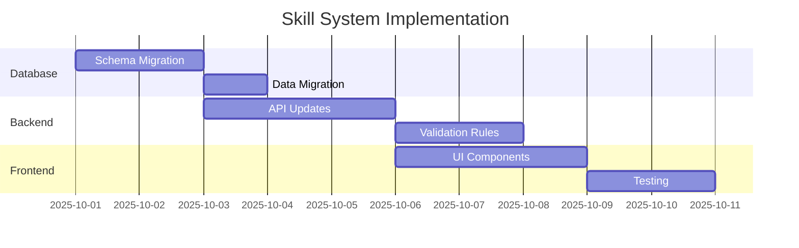
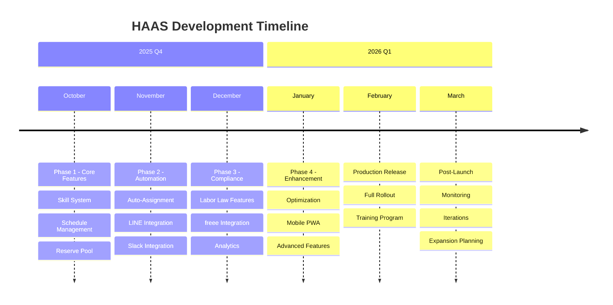

# HAAS 開発ロードマップ
# HKT48劇場 スタッフアサイン＆勤怠システム - 開発ロードマップ

## 目次
1. [実行サマリー](#実行サマリー)
2. [現在の状況](#現在の状況)
3. [開発フェーズ](#開発フェーズ)
4. [機能バックログ](#機能バックログ)
5. [技術的負債](#技術的負債)
6. [リスク評価](#リスク評価)
7. [成功指標](#成功指標)

## 実行サマリー

このロードマップは、現在のMVP実装からHKT48劇場スタッフ管理のための全機能システムまでの開発パスを概説しています。システムは日本の労働法要件と運用ニーズを満たすための重要な強化が必要です。

### プロジェクトビジョン
現在の基本的な勤怠システムを、4つのスキルタイプ、自動アサインメント、労働法遵守、外部サービスとのシームレスな連携を処理する包括的なスタッフ管理プラットフォームに変革します。

### 主要なビジネスドライバー
- **コンプライアンス**: 日本の労働法要件（週40時間、必須休憩）
- **効率**: 手動アサインメント時間の80%削減
- **精度**: GPS+QR検証で勤怠不正を排除
- **拡張性**: 複数会場と100以上のスタッフをサポート

## 現在の状況

### MVP実装（2025年9月22日現在）

#### ✅ 実装完了機能
- **認証システム**
  - Supabase Auth連携
  - JWTベースセッション管理
  - ロールベースアクセス制御（管理者/スタッフ）

- **GPS勤怠追跡**
  - 位置検証（会場から±300m）
  - ハバーサイン距離計算
  - HKT48劇場座標: 33.5904, 130.4017

- **QRコード検証**
  - 機材ベースQRスキャン
  - 機材ごとのユニークQRコード
  - GPSと組み合わせた2要素検証

- **基本スタッフ管理**
  - スタッフプロフィールのCRUD操作
  - 認証ユーザーへのリンク
  - アクティブ/非アクティブ状態追跡

- **データベースインフラ**
  - PostGIS付きPostgreSQL
  - RLSポリシー（最近修正）
  - マイグレーションシステム導入済み

- **本番デプロイメント**
  - Vercelホスティング稼働中
  - URL: https://haas-nu.vercel.app/
  - GitHubからの自動デプロイメント

- **✅ 4つのスキルタイプ実装済み** (PA、sound_operator、lighting、backstage)

#### 🚧 部分実装
- **アサインメントシステム**: 基本のみ、自動化なし
- **写真撮影**: データベーススキーマ準備済み、API未実装

#### ❌ 未実装
- **スタッフごとの複数スキル**: 結合テーブルが必要
- **週単位スケジュール**: スタッフ出勤可能時間管理
- **予備プール**: バックアップスタッフ管理
- **労働法チェック**: 週40時間、休憩要件
- **自動アサインメント**: 最適スタッフ配置
- **外部通知**: LINE/Slack連携
- **給与エクスポート**: freee API連携

### Technical Environment
```yaml
Frontend:
  Framework: Next.js 14.2.7
  UI: React 18.2.0 + Tailwind CSS 3.4.10
  Language: TypeScript 5.5.4

Backend:
  Database: PostgreSQL 15+ with PostGIS
  Platform: Supabase (Auth, Database, Storage)
  API: Next.js API Routes

Testing:
  Unit: Jest
  E2E: Playwright
  Mocking: MSW

Infrastructure:
  Hosting: Vercel
  CI/CD: GitHub Actions
  Monitoring: Vercel Analytics
```

## 開発フェーズ

### フェーズ1: コア機能完成（4週間）
**タイムライン**: 2025年10月
**予算**: ¥1,600,000
**チーム**: 開発者 2名

#### 第1-2週: スキルシステムの大幅改修


**成果物:**
- [ ] スタッフごとの複数スキル対応実装
- [ ] staff_skills結合テーブル実装
- [ ] 習熟レベル追加 (1-5)
- [ ] スキルアサインUI作成
- [ ] 複数スキル用アサインメントロジック更新

#### 第3週: スケジュール管理
**成果物:**
- [ ] 週単位出勤可能時間登録UI
- [ ] 反復スケジュールパターン
- [ ] 競合検出システム
- [ ] マネージャー用カレンダービュー

#### 第4週: 予備プールと通知
**成果物:**
- [ ] 予備メンバーデータベース
- [ ] 優先順位ランキングシステム
- [ ] 基本通知テンプレート
- [ ] 手動通知トリガー

### Phase 2: Automation & Integration (3 weeks)
**Timeline**: November 2025
**Budget**: ¥1,200,000
**Team**: 2 developers

#### Week 1: Auto-Assignment Algorithm
```python
# Pseudo-code for assignment algorithm
def auto_assign_shifts(shift):
    candidates = get_available_staff(shift.date, shift.skill_type)
    candidates = filter_by_labor_compliance(candidates)
    candidates = sort_by_priority(candidates, factors=[
        'proficiency_level',
        'recent_work_count',
        'distance_from_venue'
    ])
    return assign_top_candidates(candidates, shift.required_count)
```

**Deliverables:**
- [ ] Assignment algorithm implementation
- [ ] Labor law compliance checks
- [ ] Fairness distribution logic
- [ ] Manual override capabilities

#### Week 2: LINE Integration
**Deliverables:**
- [ ] LINE Messaging API setup
- [ ] Rich menu for staff commands
- [ ] Push notification system
- [ ] LIFF app for mobile attendance

#### Week 3: Slack Integration
**Deliverables:**
- [ ] Slack workspace app
- [ ] Assignment notifications
- [ ] Attendance alerts
- [ ] Admin command interface

### Phase 3: Compliance & Reporting (3 weeks)
**Timeline**: December 2025
**Budget**: ¥1,200,000
**Team**: 2 developers

#### Week 1: Labor Law Compliance
**Features:**
- [ ] 40-hour weekly limit enforcement
- [ ] Mandatory break calculations
- [ ] Overtime tracking
- [ ] Weekly rest day verification
- [ ] Compliance dashboard

#### Week 2: freee Integration
**Deliverables:**
- [ ] freee API authentication
- [ ] Payroll data formatting
- [ ] Automated monthly exports
- [ ] Error handling & retry logic

#### Week 3: Analytics & Reporting
**Deliverables:**
- [ ] Attendance analytics dashboard
- [ ] Staff utilization reports
- [ ] Cost analysis tools
- [ ] Performance metrics

### Phase 4: Enhancement & Optimization (2 weeks)
**Timeline**: January 2026
**Budget**: ¥800,000
**Team**: 1 developer + 1 QA

**Deliverables:**
- [ ] Performance optimization
- [ ] Mobile app (PWA)
- [ ] Advanced scheduling features
- [ ] Bulk operations UI
- [ ] Enhanced security measures

## Feature Backlog

### High Priority (Must Have)
| Feature | Effort | Impact | Status |
|---------|--------|--------|--------|
| 4 Skill Types | 5 days | Critical | Pending |
| Multiple Skills/Staff | 3 days | Critical | Pending |
| Weekly Schedules | 5 days | Critical | Pending |
| Labor Law Checks | 7 days | Critical | Pending |
| Reserve Pool | 5 days | High | Pending |
| LINE Notifications | 5 days | High | Pending |

### Medium Priority (Should Have)
| Feature | Effort | Impact | Status |
|---------|--------|--------|--------|
| Auto-Assignment | 10 days | High | Pending |
| Slack Integration | 3 days | Medium | Pending |
| freee Export | 5 days | High | Pending |
| Photo Verification | 3 days | Medium | Schema Ready |
| Analytics Dashboard | 5 days | Medium | Pending |

### Low Priority (Nice to Have)
| Feature | Effort | Impact | Status |
|---------|--------|--------|--------|
| Mobile App (PWA) | 10 days | Medium | Pending |
| Multi-venue Support | 5 days | Low | Pending |
| Advanced Reports | 5 days | Low | Pending |
| Shift Trading | 7 days | Low | Pending |
| Gamification | 5 days | Low | Pending |

## Technical Debt

### Immediate Concerns
1. **Authentication Security**
   - Issue: All users using "password123"
   - Impact: Critical security vulnerability
   - Solution: Implement proper password policy
   - Effort: 1 day

2. **Missing Indexes**
   - Issue: No indexes on frequently queried columns
   - Impact: Performance degradation at scale
   - Solution: Add strategic indexes
   - Effort: 2 days

3. **Error Handling**
   - Issue: Inconsistent error responses
   - Impact: Poor debugging experience
   - Solution: Standardize error format
   - Effort: 3 days

### Long-term Improvements
1. **Caching Layer**
   - Add Redis for session management
   - Implement query result caching
   - Effort: 5 days

2. **Monitoring & Logging**
   - Implement Sentry for error tracking
   - Add application performance monitoring
   - Structured logging with correlation IDs
   - Effort: 3 days

3. **Testing Coverage**
   - Current: ~40% (estimated)
   - Target: 80%
   - Focus on critical paths
   - Effort: 10 days

## Risk Assessment

### High Risk Items

#### 1. Labor Law Non-compliance
- **Risk**: Legal penalties for violating labor regulations
- **Probability**: High (without implementation)
- **Impact**: Severe (fines, reputation damage)
- **Mitigation**: Prioritize Phase 3 compliance features

#### 2. Data Security Breach
- **Risk**: Unauthorized access to personal data
- **Probability**: Medium (current password weakness)
- **Impact**: Severe (privacy violations, trust loss)
- **Mitigation**: Immediate password policy implementation

#### 3. System Downtime
- **Risk**: Attendance tracking failure during events
- **Probability**: Low (Vercel reliability)
- **Impact**: High (manual fallback required)
- **Mitigation**: Implement offline capability, backup procedures

### Medium Risk Items

1. **Integration Failures**
   - LINE/Slack API changes
   - freee API compatibility
   - Mitigation: Version locking, monitoring

2. **Performance Issues**
   - Slow queries at scale
   - GPS timeout on poor connections
   - Mitigation: Optimization, caching

3. **User Adoption**
   - Staff resistance to new system
   - Training requirements
   - Mitigation: Phased rollout, training program

## Success Metrics

### Key Performance Indicators (KPIs)

#### Operational Metrics
| Metric | Current | Target | Timeline |
|--------|---------|--------|----------|
| Assignment Time | 2 hrs/week | 15 min/week | Phase 2 |
| Attendance Accuracy | 85% | 99% | Immediate |
| Schedule Conflicts | 5/month | 0/month | Phase 1 |
| Labor Compliance | 70% | 100% | Phase 3 |

#### System Metrics
| Metric | Current | Target | Timeline |
|--------|---------|--------|----------|
| API Response Time | 200ms | <100ms | Phase 4 |
| System Uptime | 99% | 99.9% | Ongoing |
| Test Coverage | 40% | 80% | Phase 4 |
| Active Users | 10 | 100+ | Phase 2 |

#### Business Metrics
| Metric | Baseline | Target | Timeline |
|--------|----------|--------|----------|
| Cost Savings | ¥0 | ¥5.2M/year | Phase 3 |
| Staff Satisfaction | N/A | 85% | Phase 2 |
| Compliance Rate | 70% | 100% | Phase 3 |
| ROI | -100% | +22% | Year 1 |

### Milestone Schedule



## Budget Summary

### Development Costs
| Phase | Duration | Team | Cost |
|-------|----------|------|------|
| Phase 1 | 4 weeks | 2 devs | ¥1,600,000 |
| Phase 2 | 3 weeks | 2 devs | ¥1,200,000 |
| Phase 3 | 3 weeks | 2 devs | ¥1,200,000 |
| Phase 4 | 2 weeks | 1 dev + QA | ¥800,000 |
| **Total** | **12 weeks** | - | **¥4,800,000** |

### Infrastructure Costs (Annual)
| Service | Monthly | Annual |
|---------|---------|--------|
| Vercel Pro | ¥3,000 | ¥36,000 |
| Supabase Pro | ¥3,000 | ¥36,000 |
| External APIs | ¥5,000 | ¥60,000 |
| Monitoring | ¥2,000 | ¥24,000 |
| **Total** | **¥13,000** | **¥156,000** |

### ROI Analysis
```
Initial Investment: ¥4,800,000 (development) + ¥156,000 (first year ops) = ¥4,956,000

Annual Savings:
- Staff time reduction: ¥2,400,000
- Error reduction: ¥1,200,000
- Compliance avoidance: ¥1,600,000
Total: ¥5,200,000/year

Break-even: Month 11
Year 1 ROI: +5% (¥244,000)
Year 2 ROI: +105% (¥5,200,000)
```

## Next Steps

### Immediate Actions (This Week)
1. ✅ Fix password security vulnerability
2. ✅ Complete documentation organization
3. ⬜ Set up development environment for Phase 1
4. ⬜ Recruit additional developer if needed
5. ⬜ Finalize requirements with stakeholders

### Phase 1 Kickoff Checklist
- [ ] Technical specification review
- [ ] Database migration plan approved
- [ ] Development environment ready
- [ ] Testing strategy defined
- [ ] Stakeholder sign-off obtained

---

**ドキュメントバージョン**: 1.0.0
**最終更新**: 2025年9月22日
**状況**: 計画段階
**責任者**: 開発チーム
**レビューサイクル**: 開発中は週次、リリース後は月次