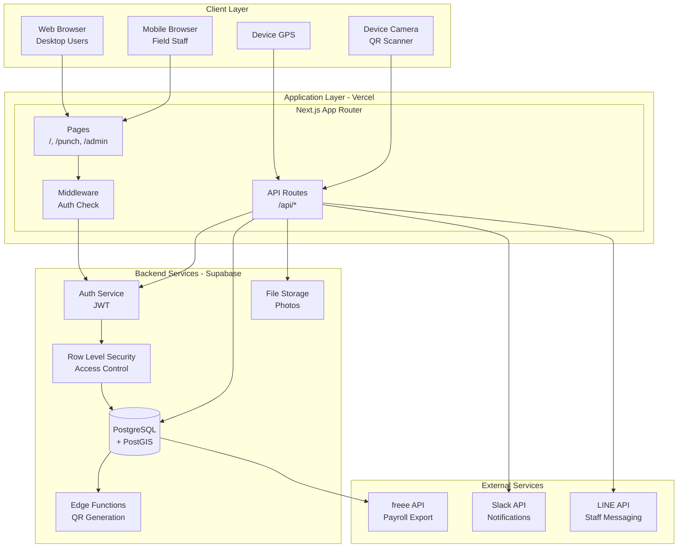
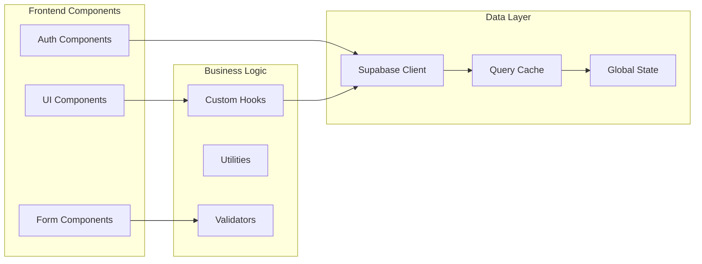
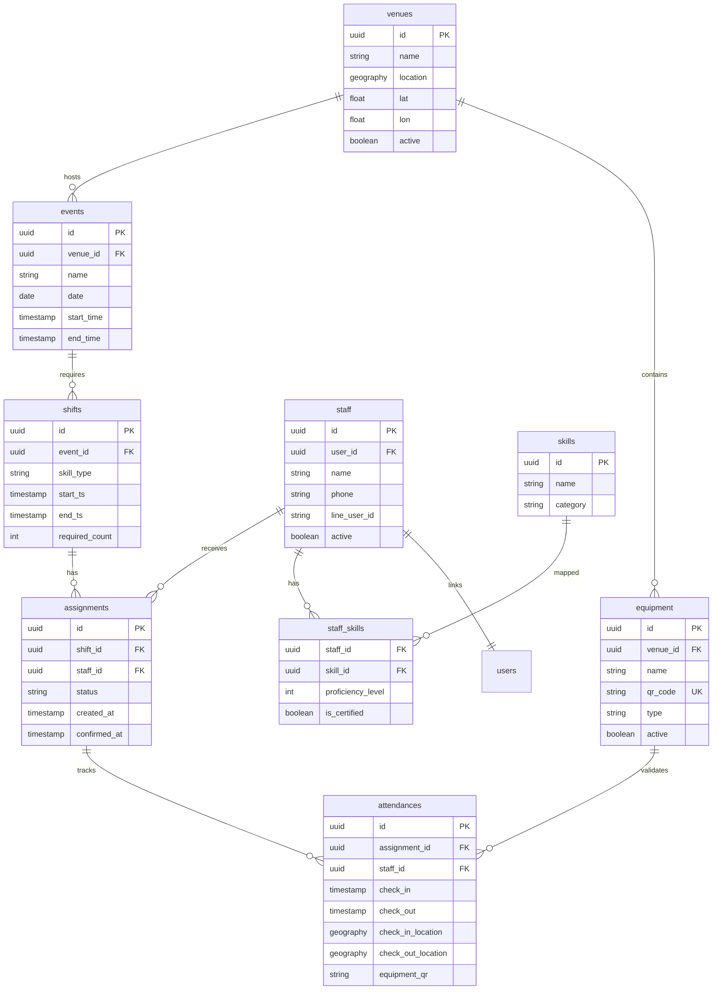
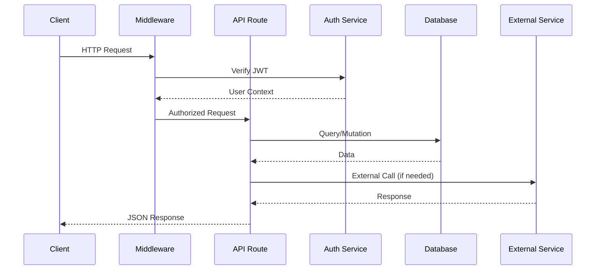
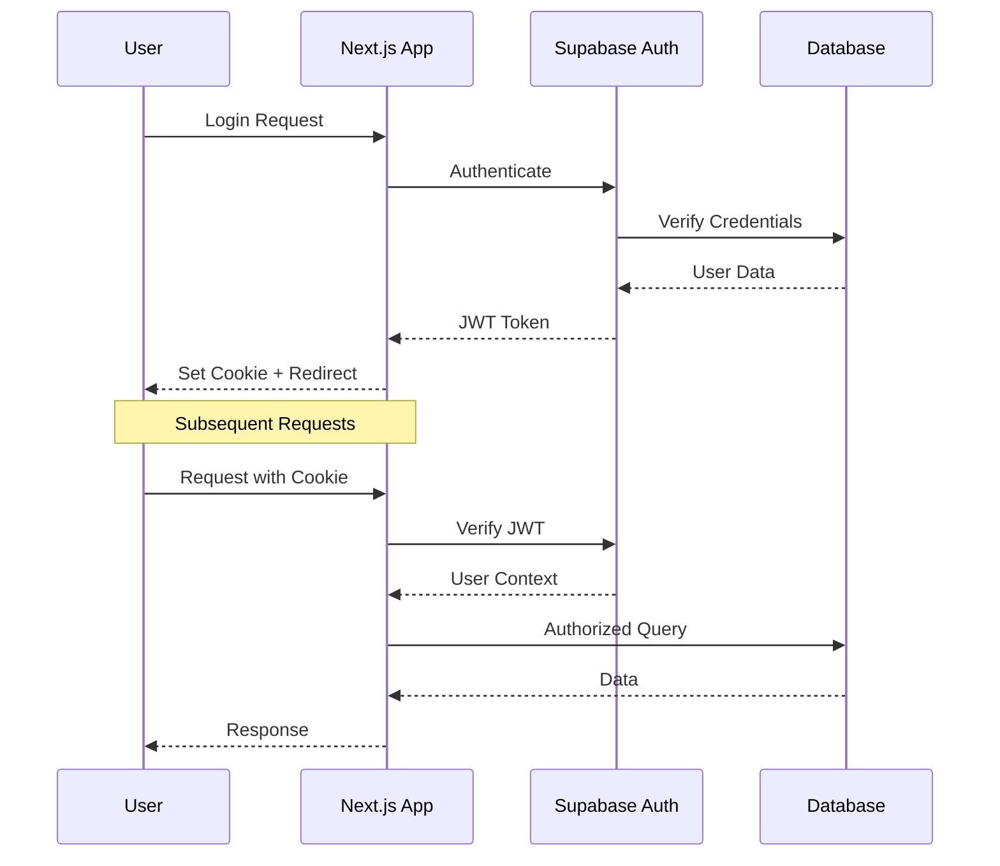
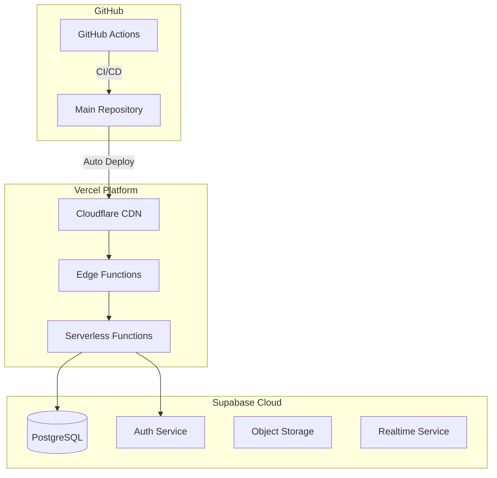

# HAAS システムアーキテクチャドキュメント
# HKT48劇場 スタッフアサイン＆勤怠システム - システムアーキテクチャ

## 目次
1. [システム概要](#システム概要)
2. [技術スタック](#技術スタック)
3. [システムアーキテクチャ](#システムアーキテクチャ)
4. [データベース設計](#データベース設計)
5. [API アーキテクチャ](#api-アーキテクチャ)
6. [認証とセキュリティ](#認証とセキュリティ)
7. [外部連携](#外部連携)
8. [デプロイメントアーキテクチャ](#デプロイメントアーキテクチャ)
9. [開発状況](#開発状況)

## システム概要

**HAAS (HKT Assign & Attendance System)** は、HKT48劇場運営のための包括的なスタッフ管理システムで、厳格なGPSとQRコード認証による勤怠追跡を実装しています。

### 主要なビジネス要件
- **スタッフ管理**: 4つのスキルタイプの管理 (PA、sound_operator、lighting、backstage)
- **勤怠追跡**: GPSベースの位置確認（会場から±300m以内）
- **QR認証**: 機材ベースのチェックイン・チェックアウト認証
- **スケジュール管理**: 週単位の出勤可能時間とシフト割り当て
- **法令遵守**: 日本の労働基準法遵守（週40時間、必要な休憩時間）

### 現在の実装段階
- **状況**: MVP段階（本番デプロイ済み）
- **URL**: https://haas-nu.vercel.app/
- **バージョン**: 1.0.0
- **最終メジャーアップデート**: 2025年9月22日（RLS修正）

## 技術スタック

### フロントエンド技術
| コンポーネント | 技術 | バージョン | 用途 |
|-----------|------------|---------|----------|
| **フレームワーク** | Next.js | 14.2.7 | App Router付きReactフレームワーク |
| **UIライブラリ** | React | 18.2.0 | コンポーネントライブラリ |
| **言語** | TypeScript | 5.5.4 | 型安全性 |
| **スタイリング** | Tailwind CSS | 3.4.10 | ユーティリティファーストCSS |
| **状態管理** | React Hooks | - | 組み込み状態管理 |

### バックエンド技術
| コンポーネント | 技術 | バージョン | 用途 |
|-----------|------------|---------|----------|
| **データベース** | PostgreSQL | 15+ | メインデータベース |
| **GIS拡張** | PostGIS | 3.0+ | 地理データ処理 |
| **BaaSプラットフォーム** | Supabase | Latest | バックエンドサービス |
| **認証プロバイダー** | Supabase Auth | - | JWTベース認証 |
| **バリデーション** | Zod | 3.23.8 | スキーマ検証 |

### インフラストラクチャ
| コンポーネント | 技術 | 用途 |
|-----------|------------|----------|
| **ホスティング** | Vercel | 自動デプロイ付きアプリケーションホスティング |
| **データベースホスト** | Supabase Cloud | マネージドPostgreSQL |
| **Edge Functions** | Supabase Functions | Denoベースサーバーレス関数 |
| **CDN** | Vercel Edge Network | グローバルコンテンツ配信 |

### 開発ツール
| ツール | 用途 |
|------|----------|
| **テスト** | Jest, Playwright, MSW | ユニット、統合、E2Eテスト |
| **CI/CD** | GitHub Actions | 自動テストとデプロイメント |
| **バージョン管理** | GitHub | ソースコード管理 |
| **コード品質** | ESLint, TypeScript | コーディング標準の強制 |

## システムアーキテクチャ

### 高次レベルアーキテクチャ図



### コンポーネントアーキテクチャ



## データベース設計

### コアテーブル構造



### データベースビュー

```sql
-- v_payroll_monthly: Aggregated monthly attendance for payroll
CREATE VIEW v_payroll_monthly AS
SELECT
    s.name,
    s.phone,
    DATE_TRUNC('month', a.check_in) as month,
    COUNT(DISTINCT DATE(a.check_in)) as days_worked,
    SUM(EXTRACT(EPOCH FROM (a.check_out - a.check_in))/3600) as total_hours,
    SUM(
        CASE
            WHEN EXTRACT(EPOCH FROM (a.check_out - a.check_in))/3600 > 8
            THEN 60
            WHEN EXTRACT(EPOCH FROM (a.check_out - a.check_in))/3600 > 6
            THEN 45
            ELSE 0
        END
    ) as break_minutes
FROM attendances a
JOIN staff s ON a.staff_id = s.id
WHERE a.check_out IS NOT NULL
GROUP BY s.name, s.phone, DATE_TRUNC('month', a.check_in);
```

### 行レベルセキュリティ (RLS) ポリシー

現在のRLS実装（マイグレーション017以降）:

```sql
-- Staff table policies (simplified to avoid recursion)
-- 1. All authenticated users can read all staff
CREATE POLICY "staff_select_all_simple" ON public.staff
    FOR SELECT TO authenticated
    USING (true);

-- 2. Users can update their own record only
CREATE POLICY "staff_update_self_simple" ON public.staff
    FOR UPDATE TO authenticated
    USING (user_id = auth.uid())
    WITH CHECK (user_id = auth.uid());

-- 3. Users can insert their own record
CREATE POLICY "staff_insert_simple" ON public.staff
    FOR INSERT TO authenticated
    WITH CHECK (user_id = auth.uid());
```

### 重要なデータベース関数

```sql
-- attendance_punch: Core function for check-in/check-out
CREATE FUNCTION attendance_punch(
    p_staff_uid uuid,
    p_shift_id uuid,
    p_equipment_qr text,
    p_lat float,
    p_lon float,
    p_purpose text
) RETURNS json
```

## API アーキテクチャ

### RESTful API エンドポイント

#### 認証エンドポイント
| メソッド | エンドポイント | 用途 | 認証必要 |
|--------|----------|---------|---------------|
| POST | `/api/auth/login` | ユーザーログイン | 不要 |
| POST | `/api/auth/logout` | ユーザーログアウト | 必要 |
| GET | `/api/auth/me` | 現在のユーザー取得 | 必要 |

#### 勤怠エンドポイント
| メソッド | エンドポイント | 用途 | 認証必要 |
|--------|----------|---------|---------------|
| POST | `/api/attendance/punch` | チェックイン/アウト | 必要 |

#### 管理者エンドポイント
| メソッド | エンドポイント | 用途 | 認証必要 |
|--------|----------|---------|---------------|
| GET | `/api/admin/staff` | スタッフ一覧 | 管理者 |
| POST | `/api/admin/staff` | スタッフ作成 | 管理者 |
| GET | `/api/admin/staff/[id]` | スタッフ詳細取得 | 管理者 |
| PUT | `/api/admin/staff/[id]` | スタッフ更新 | 管理者 |
| DELETE | `/api/admin/staff/[id]` | スタッフ削除 | 管理者 |
| GET | `/api/admin/events` | イベント一覧 | 管理者 |
| GET | `/api/admin/shifts` | シフト一覧 | 管理者 |
| POST | `/api/admin/assign` | アサイン作成 | 管理者 |
| GET | `/api/admin/skills` | スキル一覧 | 管理者 |

#### スタッフエンドポイント
| メソッド | エンドポイント | 用途 | 認証必要 |
|--------|----------|---------|---------------|
| GET | `/api/staff/schedule` | 自分のスケジュール取得 | 必要 |

#### 外部Webhook
| メソッド | エンドポイント | 用途 | 認証必要 |
|--------|----------|---------|---------------|
| POST | `/api/line-webhook` | LINE bot webhook | HMAC署名 |
| POST | `/api/slack-webhook` | Slack bot webhook | 署名シークレット |

### API リクエスト/レスポンスフロー



### データ検証

すべてのAPIエンドポイントでZodスキーマを使用したリクエスト検証:

```typescript
// Example: Attendance punch validation
const punchSchema = z.object({
  equipment_qr: z.string().min(1),
  lat: z.number().min(-90).max(90),
  lon: z.number().min(-180).max(180),
  purpose: z.enum(['checkin', 'checkout'])
})
```

## 認証とセキュリティ

### 認証フロー



### セキュリティ対策

#### 現在の実装
- **JWT認証**: セキュアクッキー付きSupabase Auth
- **RLSポリシー**: データベースレベルアクセス制御
- **HMAC検証**: LINE webhook署名検証
- **環境変数**: パブリック/サーバーキーの分離
- **HTTPS強制**: 本番環境で強制
- **GPS検証**: 会場から±300m半径チェック

#### テスト環境設定
- すべてのテストユーザーはパスワード: `password123` （MVP段階のみ）
- 管理操作用サービスロールキー
- クライアントサイドSDK用匿名キー

### 環境変数

```bash
# Public (exposed to client)
NEXT_PUBLIC_SUPABASE_URL=        # Supabase project URL
NEXT_PUBLIC_SUPABASE_ANON_KEY=   # Public anonymous key

# Server-only (never exposed)
SUPABASE_SERVICE_ROLE_KEY=       # Admin access key
LINE_CHANNEL_SECRET=              # LINE webhook verification
LINE_CHANNEL_ACCESS_TOKEN=        # LINE bot token
SLACK_SIGNING_SECRET=             # Slack webhook verification
SLACK_BOT_TOKEN=                  # Slack bot token
APP_BASE_URL=                     # Application base URL
```

## 外部連携

### LINE Messaging API
- **用途**: スタッフ通知とシフト確認
- **Webhook**: `/api/line-webhook`
- **コマンド**: CONFIRM, DECLINE
- **セキュリティ**: HMAC署名検証

### Slack API
- **用途**: 管理者通知とチーム連携
- **Webhook**: `/api/slack-webhook`
- **機能**: アサイン更新、勤怠アラート
- **セキュリティ**: 署名シークレット検証

### freee Accounting API （予定）
- **用途**: 給与データエクスポート
- **フォーマット**: `v_payroll_monthly`ビューからのCSVエクスポート
- **頻度**: 月次バッチ処理

### GPS/位置情報サービス
- **プロバイダー**: ブラウザーGeolocation API
- **精度**: 高精度モード有効
- **タイムアウト**: 30秒
- **検証**: ハバーサイン公式で距離計算

## デプロイメントアーキテクチャ

### 本番環境



### デプロイメント設定

```json
// vercel.json
{
  "functions": {
    "app/api/attendance/punch/route.ts": {
      "maxDuration": 10
    }
  },
  "rewrites": [
    {
      "source": "/api/:path*",
      "destination": "/api/:path*"
    }
  ]
}
```

### CI/CDパイプライン

```yaml
# GitHub Actions workflow
name: Deploy to Production
on:
  push:
    branches: [main]
  pull_request:
    branches: [main]

jobs:
  test:
    runs-on: ubuntu-latest
    steps:
      - Test suite execution
      - Coverage reporting
      - Security scanning

  deploy:
    needs: test
    if: github.ref == 'refs/heads/main'
    steps:
      - Deploy to Vercel
      - Run smoke tests
      - Notify team
```

## 開発状況

### 実装済み機能 ✅

#### コア機能
- Supabase Authでのユーザー認証
- GPSベース勤怠追跡（±300m検証）
- QRコード機材スキャン
- スタッフ管理CRUD操作
- 基本的なシフトアサインシステム
- ロールベースアクセス付き管理ダッシュボード
- **4つのスキルタイプ** (PA、sound_operator、lighting、backstage) ✅

#### データベースとインフラ
- PostGIS拡張付きPostgreSQL
- 行レベルセキュリティポリシー（再帰問題修正済み）
- 自動マイグレーションシステム
- Vercel本番デプロイメント
- Supabaseバックエンドサービス

#### テストインフラ
- Jestユニットテストフレームワーク
- Playwright E2Eテスト
- MSW APIモッキング
- 70%カバレッジ目標

### 開発中 🚧

#### 開発中の機能
- 勤怠用写真撮影（スキーマ準備済み、API未実装）
- Slack通知実装
- LINE botコマンド処理
- 自動シフトアサイン

### 予定機能 📋

#### フェーズ1 - 基本機能（4週間）
- スタッフごとの複数スキル割り当て
- 週単位スケジュール登録
- 予備プール管理
- 労働基準法遵守チェック

#### フェーズ2 - 自動化（3週間）
- 自動最適アサインアルゴリズム
- Slack/LINE通知システム
- 予備メンバー自動通知
- バッチアサイン処理

#### フェーズ3 - 連携（3週間）
- freee API連携
- LIFF（LINE Front-end Framework）連携
- 高度レポーティングダッシュボード
- パフォーマンス最適化

### 既知の問題と制限

#### 現在の制限
1. **認証**: すべてのユーザーが現在 "password123" を使用（MVP段階）
2. **スキル**: ✅ 4つのスキルが実装済み（PA、sound_operator、lighting、backstage）
3. **通知**: 外部通知未稼働
4. **写真**: Storage設定済みだがアップロード未実装

#### 最近の修正
1. **RLS再帰問題** （2025年9月22日修正）
   - 無限ループを引き起こす再帰ポリシーを削除
   - 基本的な読み取り全部、自分更新パターンに簡略化
   - マイグレーション015-017でこの問題に対処

#### パフォーマンスの考慮事項
- GPS計算はアプリケーション層で実行（スケール時はPostGISを検討）
- キャッシュ層未実装
- 大規模クエリ用データベースインデックスが必要

### 開発ガイドライン

#### コード組織
```
app/                    # Next.js App Router
├── api/               # APIルート
├── admin/             # 管理ページ
├── (auth)/            # 認証関連ページ
└── components/        # Reactコンポーネント

lib/                   # ユーティリティとヘルパー
├── supabase/         # Supabaseクライアント
└── utils/            # ヘルパー関数

supabase/             # データベース関連
├── migrations/       # SQLマイグレーション
└── functions/        # Edge関数
```

#### テスト戦略
- ユーティリティとコンポーネントのユニットテスト
- APIルートの統合テスト
- 重要なユーザーフローのE2Eテスト
- 最低70%コードカバレッジ

#### Gitワークフロー
- `main`からの機能ブランチ
- PRレビュー必須
- `main`へのマージで自動デプロイ
- セマンティックバージョニング

---

**ドキュメントバージョン**: 1.0.0
**最終更新**: 2025年9月22日
**状態**: アクティブ開発（MVP段階）
**維持者**: 開発チーム