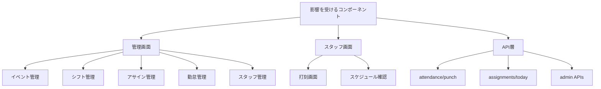
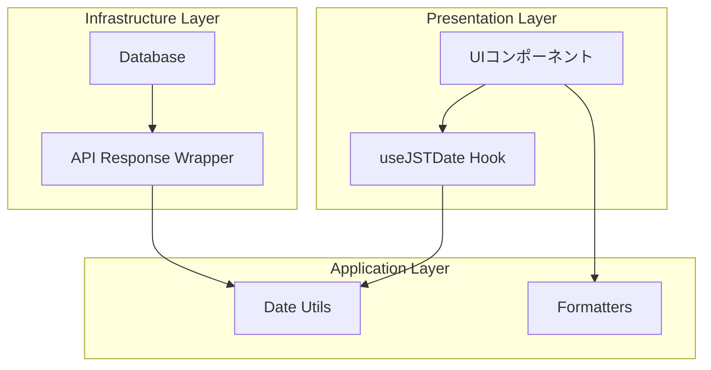
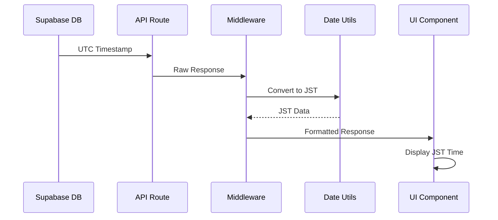

# タイムゾーン処理アーキテクチャ設計書

## 目次
1. [問題分析](#問題分析)
2. [解決方針](#解決方針)
3. [アーキテクチャ概要](#アーキテクチャ概要)
4. [実装パターン](#実装パターン)
5. [技術選定](#技術選定)
6. [移行計画](#移行計画)
7. [テスト戦略](#テスト戦略)

## 問題分析

### 現状の問題点

#### 1. 分散した変換処理
- 各ページで独自のタイムゾーン変換処理を実装
- 例: `events/page.tsx`では`formatTime()`、`shifts/page.tsx`では別の`formatTime()`
- コードの重複と不整合のリスク

#### 2. 場当たり的な処理
- 正規表現での時刻抽出（`/T(\d{2}):(\d{2})/`）
- `toLocaleString`と`toLocaleDateString`の混在
- エラーハンドリングの不一致

#### 3. 暗黙的な前提
- Supabaseのタイムスタンプ形式（UTC）への依存
- JST固定の前提がコード内に散在
- タイムゾーン情報の欠落

#### 4. メンテナビリティの問題
- 変更時の影響範囲が不明確
- テストの困難性
- 新規開発者の学習コスト

### 影響範囲



## 解決方針

### 設計原則

1. **単一責任の原則（SRP）**
   - タイムゾーン変換はユーティリティ層で一元管理
   - 各コンポーネントは変換済みデータを利用

2. **DRY原則**
   - 重複コードの排除
   - 共通関数の活用

3. **明示的な処理**
   - タイムゾーン情報を明示的に扱う
   - 変換タイミングの明確化

4. **テスタブル**
   - 純粋関数による実装
   - モック可能な設計

### 層別アプローチ



## アーキテクチャ概要

### コア機能

#### 1. Date Utilities (`/lib/utils/date.ts`)
- UTC/JST変換
- タイムスタンプ解析
- 日付操作

#### 2. Formatting Functions (`/lib/utils/formatters.ts`)
- 表示用フォーマット
- カスタムフォーマット
- ロケール対応

#### 3. React Hooks (`/hooks/useJSTDate.ts`)
- リアクティブな日時処理
- 自動更新機能
- コンポーネント最適化

#### 4. API Middleware (`/lib/api/middleware.ts`)
- レスポンス自動変換
- タイムゾーンメタデータ付与

### データフロー



## 実装パターン

### パターン1: ユーティリティ関数パターン

```typescript
// 使用例
import { formatToJST, parseTimestamp } from '@/lib/utils/date';

const Component = () => {
  const jstTime = formatToJST(utcTimestamp);
  return <div>{jstTime}</div>;
};
```

### パターン2: カスタムHookパターン

```typescript
// 使用例
import { useJSTDate } from '@/hooks/useJSTDate';

const Component = () => {
  const { format, parse } = useJSTDate();
  const jstTime = format(utcTimestamp, 'YYYY-MM-DD HH:mm');
  return <div>{jstTime}</div>;
};
```

### パターン3: HOC（Higher-Order Component）パターン

```typescript
// 使用例
import { withJSTDate } from '@/lib/hoc/withJSTDate';

const Component = withJSTDate(({ formatDate }) => {
  return <div>{formatDate(timestamp)}</div>;
});
```

### パターン4: Context APIパターン

```typescript
// 使用例
import { useDateContext } from '@/contexts/DateContext';

const Component = () => {
  const { timezone, format } = useDateContext();
  return <div>{format(timestamp, { timezone })}</div>;
};
```

## 技術選定

### 日付ライブラリの比較

| ライブラリ | サイズ | 特徴 | 推奨度 |
|----------|-------|------|-------|
| **date-fns** | 75KB (tree-shakable) | 関数型、モジュラー | ★★★★★ |
| date-fns-tz | +20KB | タイムゾーン拡張 | ★★★★★ |
| dayjs | 2KB (core) | 軽量、Moment.js互換 | ★★★★☆ |
| moment-timezone | 330KB | 機能豊富（非推奨） | ★★☆☆☆ |
| Native Date | 0KB | 標準API | ★★★☆☆ |

### 推奨: date-fns + date-fns-tz

**理由:**
1. Tree-shakingによる最適化
2. TypeScript完全サポート
3. 純粋関数による実装
4. 豊富なフォーマットオプション
5. タイムゾーン処理の明確な分離

## 移行計画

### フェーズ1: 基盤整備（1週間）
- [ ] date-fns/date-fns-tzのインストール
- [ ] 基本ユーティリティ関数の実装
- [ ] カスタムHookの実装
- [ ] ユニットテストの作成

### フェーズ2: 段階的移行（2週間）
- [ ] 高優先度ページから順次移行
  1. 打刻ページ（punch/page.tsx）
  2. 勤怠管理（admin/attendance）
  3. シフト管理（admin/shifts）
  4. イベント管理（admin/events）
- [ ] APIレスポンスラッパーの実装
- [ ] 既存コードのリファクタリング

### フェーズ3: 完全移行（1週間）
- [ ] 残りのページの移行
- [ ] 古いコードの削除
- [ ] ドキュメントの更新
- [ ] パフォーマンステスト

### フェーズ4: 最適化（継続的）
- [ ] パフォーマンスモニタリング
- [ ] バンドルサイズの最適化
- [ ] キャッシュ戦略の実装

## テスト戦略

### ユニットテスト

```typescript
describe('Date Utils', () => {
  test('UTC to JST conversion', () => {
    const utc = '2024-01-01T00:00:00Z';
    const jst = formatToJST(utc);
    expect(jst).toBe('2024-01-01 09:00');
  });

  test('JST to UTC conversion', () => {
    const jst = '2024-01-01 09:00';
    const utc = parseToUTC(jst);
    expect(utc).toBe('2024-01-01T00:00:00Z');
  });
});
```

### 統合テスト

```typescript
describe('Attendance API with Timezone', () => {
  test('Returns JST formatted timestamps', async () => {
    const response = await fetch('/api/attendance/today');
    const data = await response.json();

    expect(data.check_in_time).toMatch(/^\d{4}-\d{2}-\d{2} \d{2}:\d{2}$/);
    expect(data.timezone).toBe('Asia/Tokyo');
  });
});
```

### E2Eテスト

```typescript
test('Display correct JST time in UI', async ({ page }) => {
  await page.goto('/admin/attendance');
  const timeElement = await page.locator('[data-testid="check-in-time"]');
  const timeText = await timeElement.textContent();

  // JSTフォーマットの確認
  expect(timeText).toMatch(/\d{2}:\d{2}/);
});
```

## パフォーマンス考慮事項

### 1. メモ化
- 高頻度で呼ばれる変換処理のメモ化
- React.memoによるコンポーネント最適化

### 2. 遅延読み込み
- date-fnsの動的インポート
- 必要な関数のみのインポート

### 3. バッチ処理
- 複数の日付変換を一括処理
- APIレスポンスでの一括変換

### 4. キャッシュ戦略
- 変換結果のキャッシュ
- ブラウザタイムゾーン情報のキャッシュ

## セキュリティ考慮事項

1. **タイムゾーン偽装対策**
   - サーバーサイドでの検証
   - クライアントタイムゾーンの検証

2. **データ整合性**
   - UTCでの永続化
   - 表示層でのみJST変換

3. **監査ログ**
   - タイムスタンプの変更履歴
   - タイムゾーン変更の記録

## まとめ

本アーキテクチャにより、以下の効果が期待できます：

1. **保守性の向上**: 一元管理による変更の容易性
2. **品質の向上**: 統一された処理による一貫性
3. **開発効率の向上**: 再利用可能なコンポーネント
4. **パフォーマンスの最適化**: 効率的な変換処理
5. **テスタビリティの向上**: 明確な責任分離

次のステップは、このアーキテクチャに基づいた具体的な実装です。