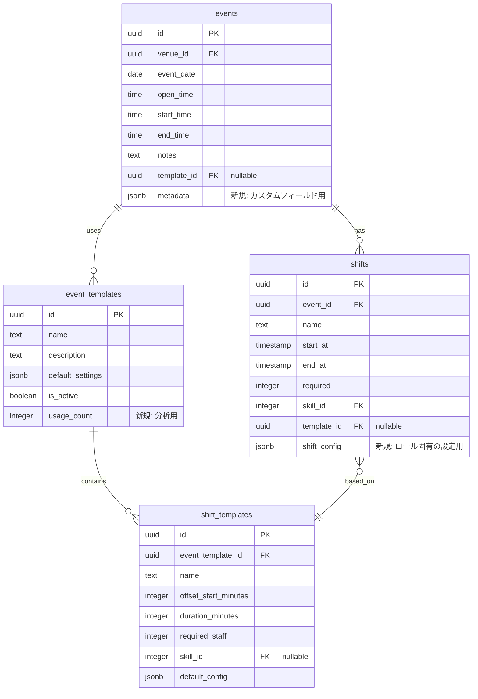
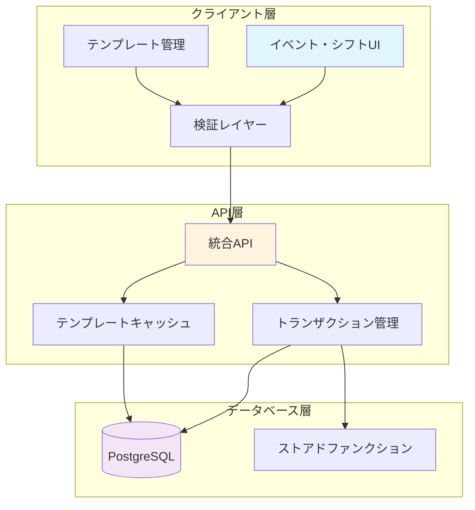
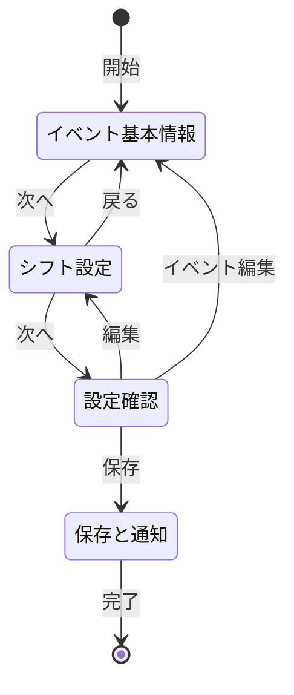
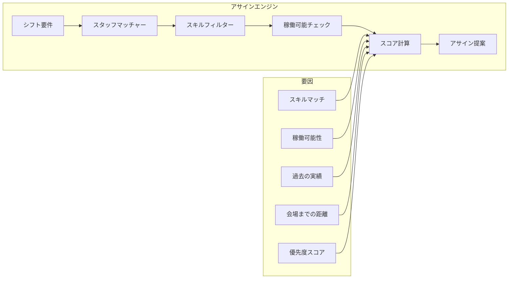
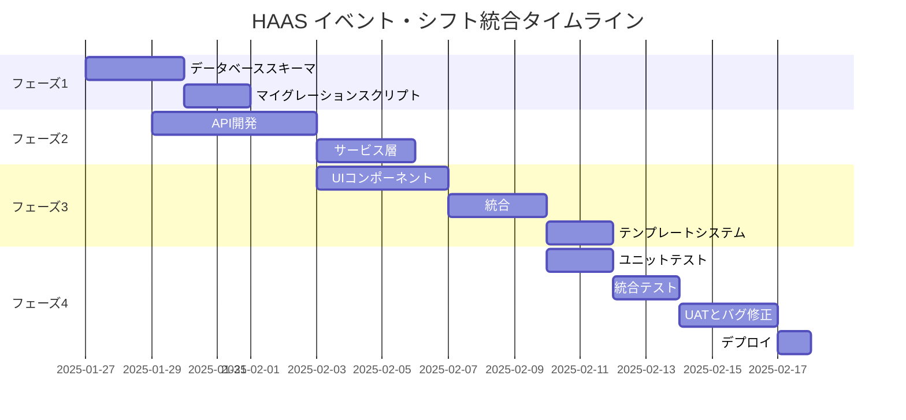

# HAAS イベント・シフト統合アーキテクチャ設計書

## エグゼクティブサマリー

本文書は、HAAS（HKT Assign & Attendance System）におけるイベントとシフト管理の統合アーキテクチャ設計を概説します。この統合により、イベントコーディネーターのワークフローが効率化され、イベントとそれに関連するシフトの同時作成・管理が可能になり、後方互換性を維持しながら将来の拡張性をサポートします。

## 目次

1. [現状分析](#現状分析)
2. [アーキテクチャ設計](#アーキテクチャ設計)
3. [実装戦略](#実装戦略)
4. [ユーザーインターフェース設計](#ユーザーインターフェース設計)
5. [技術的考慮事項](#技術的考慮事項)
6. [将来の拡張性](#将来の拡張性)

---

## 1. 現状分析

### 1.1 既存実装

#### データベーススキーマ
- **Eventsテーブル**: venue_id、日付、時間を含むイベント情報を格納
- **Shiftsテーブル**: event_id外部キーでイベントと関連、CASCADE削除あり
- **Skillsテーブル**: 4つのスキル（PA、Sound、Lighting、Backstage）のマスタデータ
- **リレーション**: イベントとシフト間は1対多の関係

#### 現在のインターフェース
- `/admin/events/page.tsx`: 単独のイベント管理
- `/admin/shifts/page.tsx`: イベント選択が必要な別個のシフト管理
- `/admin/events-integrated/page.tsx`: 既存の統合インターフェース（プロトタイプ段階）

#### 主な観察点
1. **責任の分離**: イベントとシフトが別々に管理され、複数のステップが必要
2. **既存の統合**: プロトタイプの統合ページは存在するが機能強化が必要
3. **カスケード削除**: データベースは既にイベント削除時のシフト削除をサポート
4. **スキル要件**: システムは4つのスキルすべてが割り当てられたスタッフでカバーされることを強制

### 1.2 課題点
- イベント作成時に複数ページ間の切り替えが必要
- 共通シフトパターンのテンプレートシステムがない
- 設営・撤去期間の手動時間計算
- 定期イベントのバッチ操作がない

---

## 2. アーキテクチャ設計

### 2.1 データベーススキーマ変更



### 2.2 APIエンドポイント設計

#### 新規統合エンドポイント

```typescript
// POST /api/admin/events/integrated
interface CreateIntegratedEventRequest {
  event: {
    venue_id: string;
    event_date: string;
    open_time: string;
    start_time: string;
    end_time: string;
    notes?: string;
    template_id?: string;
  };
  shifts: Array<{
    name?: string;
    start_time: string;
    end_time: string;
    required: number;
    skill_id?: number;
  }>;
}

// PUT /api/admin/events/integrated/:id
interface UpdateIntegratedEventRequest {
  event?: Partial<EventData>;
  shifts?: {
    create?: ShiftData[];
    update?: Array<{ id: string } & Partial<ShiftData>>;
    delete?: string[];
  };
}

// GET /api/admin/templates/events
interface EventTemplatesResponse {
  templates: Array<{
    id: string;
    name: string;
    description: string;
    shift_patterns: ShiftTemplate[];
    usage_count: number;
  }>;
}
```

### 2.3 データフローアーキテクチャ



### 2.4 サービスアーキテクチャ

```typescript
// services/event-shift.service.ts
class EventShiftService {
  async createWithShifts(data: IntegratedEventData): Promise<Event> {
    return await this.db.transaction(async (trx) => {
      // 1. イベント作成
      const event = await trx.events.create(data.event);

      // 2. シフトのバッチ作成
      const shifts = await trx.shifts.createMany(
        data.shifts.map(shift => ({
          ...shift,
          event_id: event.id,
          start_at: this.calculateTimestamp(event.event_date, shift.start_time),
          end_at: this.calculateTimestamp(event.event_date, shift.end_time)
        }))
      );

      // 3. 監査ログ記録
      await this.auditLog.record({
        action: 'EVENT_CREATED_WITH_SHIFTS',
        event_id: event.id,
        shift_count: shifts.length
      });

      return { event, shifts };
    });
  }

  async applyTemplate(eventId: string, templateId: string): Promise<Shift[]> {
    const template = await this.templateService.get(templateId);
    const event = await this.eventService.get(eventId);

    return this.createShiftsFromTemplate(event, template);
  }
}
```

---

## 3. 実装戦略

### 3.1 マイグレーション計画

#### フェーズ1: データベース拡張（第1週）
1. マイグレーションでテンプレートテーブル追加
2. バッチ操作用のストアドプロシージャ作成
3. パフォーマンス最適化のインデックス追加

```sql
-- マイグレーション: テンプレートテーブル追加
CREATE TABLE IF NOT EXISTS event_templates (
    id UUID DEFAULT gen_random_uuid() PRIMARY KEY,
    name TEXT NOT NULL,
    description TEXT,
    default_settings JSONB,
    is_active BOOLEAN DEFAULT true,
    usage_count INTEGER DEFAULT 0,
    created_at TIMESTAMP WITH TIME ZONE DEFAULT NOW()
);

CREATE TABLE IF NOT EXISTS shift_templates (
    id UUID DEFAULT gen_random_uuid() PRIMARY KEY,
    event_template_id UUID REFERENCES event_templates(id) ON DELETE CASCADE,
    name TEXT NOT NULL,
    offset_start_minutes INTEGER NOT NULL,
    duration_minutes INTEGER NOT NULL,
    required_staff INTEGER DEFAULT 2,
    skill_id INTEGER REFERENCES skills(id),
    default_config JSONB,
    created_at TIMESTAMP WITH TIME ZONE DEFAULT NOW()
);

-- 既存テーブルへのテンプレート参照追加
ALTER TABLE events ADD COLUMN IF NOT EXISTS template_id UUID REFERENCES event_templates(id);
ALTER TABLE shifts ADD COLUMN IF NOT EXISTS template_id UUID REFERENCES shift_templates(id);

-- インデックス作成
CREATE INDEX idx_events_template_id ON events(template_id);
CREATE INDEX idx_shifts_template_id ON shifts(template_id);
```

#### フェーズ2: API開発（第1-2週）
1. 統合イベント作成エンドポイント実装
2. テンプレート管理エンドポイント追加
3. 検証ミドルウェア作成
4. トランザクション処理実装

#### フェーズ3: UI拡張（第2-3週）
1. 既存統合ページの機能強化
2. テンプレート選択とカスタマイズ追加
3. リアルタイム検証実装
4. プレビュー機能追加

#### フェーズ4: テストとデプロイ（第3-4週）
1. サービスのユニットテスト
2. APIエンドポイントの統合テスト
3. UIワークフローのE2Eテスト
4. 大規模データセットでのパフォーマンステスト

### 3.2 コード構造

```
app/
├── admin/
│   ├── events-integrated/
│   │   ├── page.tsx              # 拡張統合ページ
│   │   ├── components/
│   │   │   ├── EventForm.tsx
│   │   │   ├── ShiftBuilder.tsx
│   │   │   ├── TemplateSelector.tsx
│   │   │   └── PreviewPanel.tsx
│   │   └── hooks/
│   │       ├── useEventTemplates.ts
│   │       └── useShiftCalculator.ts
│   └── templates/
│       └── page.tsx              # テンプレート管理
├── api/
│   └── admin/
│       ├── events/
│       │   ├── integrated/
│       │   │   └── route.ts      # 統合エンドポイント
│       │   └── [id]/
│       │       └── shifts/
│       │           └── route.ts  # ネストされたシフト操作
│       └── templates/
│           └── route.ts          # テンプレートエンドポイント
└── lib/
    ├── services/
    │   ├── event-shift.service.ts
    │   └── template.service.ts
    └── validators/
        └── event-shift.validator.ts
```

### 3.3 テンプレートシステム

```typescript
// デフォルトテンプレート
const defaultTemplates = [
  {
    name: "標準コンサート",
    description: "設営、本番、撤去を含む典型的なコンサート",
    shifts: [
      { name: "設営・リハーサル", offsetMinutes: -120, duration: 60, required: 2 },
      { name: "本番", offsetMinutes: -60, duration: 240, required: 3 },
      { name: "撤去", offsetMinutes: 180, duration: 60, required: 2 }
    ]
  },
  {
    name: "劇場公演",
    description: "拡張設営時間を持つ劇場ショー",
    shifts: [
      { name: "舞台設営", offsetMinutes: -180, duration: 120, required: 3 },
      { name: "公演", offsetMinutes: -60, duration: 180, required: 2 },
      { name: "片付け", offsetMinutes: 120, duration: 45, required: 1 }
    ]
  },
  {
    name: "企業イベント",
    description: "AV要件を持つビジネスイベント",
    shifts: [
      { name: "AV設営", offsetMinutes: -90, duration: 60, required: 2 },
      { name: "イベントサポート", offsetMinutes: -30, duration: 240, required: 2 }
    ]
  }
];
```

---

## 4. ユーザーインターフェース設計

### 4.1 統合作成ワークフロー



### 4.2 UIコンポーネント

#### イベント作成ウィザード
- **ステップ1: 基本情報**
  - マップ付き会場選択
  - 空き状況カレンダー付き日付ピッカー
  - 検証付き時間フィールド
  - テンプレート選択（オプション）

- **ステップ2: シフトビルダー**
  - ビジュアルタイムラインエディタ
  - カスタマイズ可能なテンプレート適用
  - ドラッグアンドドロップによるシフト調整
  - リアルタイム競合検出
  - スタッフ要件計算機

- **ステップ3: プレビューと確認**
  - 完全なイベントサマリー
  - シフトタイムライン可視化
  - 総スタッフ要件
  - スキルカバレッジ検証
  - 保存オプション（下書き/公開）

### 4.3 検証ルール

```typescript
interface ValidationRules {
  event: {
    minLeadTime: 24,        // イベント前の時間（時間単位）
    maxFutureDate: 365,     // 未来の日数
    timeSequence: true,     // open < start < end
  };
  shifts: {
    minDuration: 30,        // 分
    maxDuration: 720,       // 分（12時間）
    maxOverlap: 4,          // 同時シフト数
    setupBuffer: 60,        // 開場前のバッファ（分）
    teardownBuffer: 60,     // 終了後のバッファ（分）
  };
  skills: {
    requireAllSkills: true, // 4つのスキルすべてが必須
    multiSkillBonus: true,  // マルチスキルスタッフを優先
  };
}
```

---

## 5. 技術的考慮事項

### 5.1 トランザクション処理

```typescript
// アトミックなイベント・シフト作成
async function createIntegratedEvent(data: IntegratedEventData) {
  const client = await pool.connect();

  try {
    await client.query('BEGIN');

    // イベント作成
    const eventResult = await client.query(
      'INSERT INTO events (...) VALUES (...) RETURNING *',
      eventValues
    );

    // シフトのバッチ作成
    const shiftQueries = data.shifts.map(shift =>
      client.query(
        'INSERT INTO shifts (...) VALUES (...) RETURNING *',
        [...shiftValues, eventResult.rows[0].id]
      )
    );

    const shiftResults = await Promise.all(shiftQueries);

    // ビジネスルール検証
    const validation = await validateShiftRequirements(
      eventResult.rows[0].id,
      client
    );

    if (!validation.isValid) {
      throw new Error(validation.message);
    }

    await client.query('COMMIT');

    return {
      event: eventResult.rows[0],
      shifts: shiftResults.map(r => r.rows[0])
    };

  } catch (error) {
    await client.query('ROLLBACK');
    throw error;
  } finally {
    client.release();
  }
}
```

### 5.2 パフォーマンス最適化

#### キャッシュ戦略
```typescript
const templateCache = new Map<string, EventTemplate>();
const CACHE_TTL = 3600000; // 1時間

async function getTemplate(id: string): Promise<EventTemplate> {
  if (templateCache.has(id)) {
    const cached = templateCache.get(id);
    if (cached.timestamp + CACHE_TTL > Date.now()) {
      return cached.data;
    }
  }

  const template = await fetchTemplate(id);
  templateCache.set(id, {
    data: template,
    timestamp: Date.now()
  });

  return template;
}
```

#### データベース最適化
```sql
-- 一般的なクエリ用の複合インデックス
CREATE INDEX idx_shifts_event_date ON shifts(event_id, start_at);
CREATE INDEX idx_events_venue_date ON events(venue_id, event_date);

-- イベントサマリー用のマテリアライズドビュー
CREATE MATERIALIZED VIEW mv_event_summaries AS
SELECT
    e.id,
    e.event_date,
    v.name as venue_name,
    COUNT(s.id) as shift_count,
    SUM(s.required) as total_staff_needed,
    ARRAY_AGG(DISTINCT sk.code) as required_skills
FROM events e
JOIN venues v ON e.venue_id = v.id
LEFT JOIN shifts s ON e.id = s.event_id
LEFT JOIN skills sk ON s.skill_id = sk.id
GROUP BY e.id, e.event_date, v.name;

-- リフレッシュ戦略
CREATE OR REPLACE FUNCTION refresh_event_summaries()
RETURNS TRIGGER AS $$
BEGIN
    REFRESH MATERIALIZED VIEW CONCURRENTLY mv_event_summaries;
    RETURN NULL;
END;
$$ LANGUAGE plpgsql;
```

### 5.3 エラーハンドリング

```typescript
class EventShiftError extends Error {
  constructor(
    message: string,
    public code: string,
    public details?: any
  ) {
    super(message);
    this.name = 'EventShiftError';
  }
}

// エラータイプ
enum ErrorCodes {
  INVALID_TIME_SEQUENCE = 'E001',
  INSUFFICIENT_STAFF = 'E002',
  SKILL_COVERAGE_INCOMPLETE = 'E003',
  TEMPLATE_NOT_FOUND = 'E004',
  VENUE_UNAVAILABLE = 'E005',
  TRANSACTION_FAILED = 'E006'
}

// ロールバック戦略
interface RollbackStrategy {
  event?: { id: string; action: 'delete' | 'revert' };
  shifts?: { ids: string[]; action: 'delete' | 'revert' };
  assignments?: { ids: string[]; action: 'delete' };
}
```

---

## 6. 将来の拡張性

### 6.1 計画機能

#### 自動アサインシステム


#### 定期イベント
```typescript
interface RecurringEventConfig {
  pattern: 'daily' | 'weekly' | 'monthly' | 'custom';
  interval: number;
  endDate?: Date;
  occurrences?: number;
  exceptions?: Date[];
  shiftVariations?: Map<number, ShiftConfig>; // 発生インデックス -> 設定
}

async function createRecurringEvents(
  baseEvent: EventData,
  config: RecurringEventConfig
): Promise<Event[]> {
  const events = [];
  const dates = generateOccurrences(baseEvent.event_date, config);

  for (const [index, date] of dates.entries()) {
    const eventData = {
      ...baseEvent,
      event_date: date,
      shifts: config.shiftVariations?.get(index) || baseEvent.shifts
    };

    events.push(await createIntegratedEvent(eventData));
  }

  return events;
}
```

#### バルク操作
```typescript
interface BulkOperation {
  type: 'create' | 'update' | 'delete';
  targets: string[]; // イベントID
  changes?: Partial<EventData>;
  shiftChanges?: ShiftBulkChange[];
}

async function executeBulkOperation(
  operation: BulkOperation
): Promise<BulkResult> {
  const results = {
    successful: [],
    failed: [],
    skipped: []
  };

  // パフォーマンスのためバッチ処理
  const BATCH_SIZE = 10;
  for (let i = 0; i < operation.targets.length; i += BATCH_SIZE) {
    const batch = operation.targets.slice(i, i + BATCH_SIZE);
    const batchResults = await Promise.allSettled(
      batch.map(id => processTarget(id, operation))
    );

    // 結果収集
    batchResults.forEach((result, index) => {
      if (result.status === 'fulfilled') {
        results.successful.push(batch[index]);
      } else {
        results.failed.push({
          id: batch[index],
          error: result.reason
        });
      }
    });
  }

  return results;
}
```

### 6.2 統合ポイント

#### 外部カレンダーシステム
- Google Calendar API統合
- iCalフィード生成
- Outlookカレンダー同期

#### スタッフコミュニケーション
- LINE通知テンプレート
- SMSフォールバックシステム
- メールダイジェストスケジューリング

#### 分析ダッシュボード
- イベント成功メトリクス
- スタッフ稼働率レポート
- スキルギャップ分析
- コスト最適化インサイト

### 6.3 スケーラビリティの考慮事項

```yaml
# スケーリング戦略
水平スケーリング:
  API層:
    - ヘルスチェック付きロードバランサー
    - 複数のAPIインスタンス
    - トランザクション用セッションアフィニティ

  データベース:
    - クエリ用リードレプリカ
    - コネクションプーリング
    - クエリ最適化

  キャッシング:
    - テンプレートキャッシュ用Redis
    - 静的アセット用CDN
    - APIレスポンス用エッジキャッシング

垂直スケーリング:
  データベース:
    - インデックス最適化
    - 日付による大規模テーブルのパーティション
    - 古いイベントのアーカイブ

  コンピュート:
    - 非同期ジョブ処理
    - バックグラウンドタスクキュー
    - スケジュール済みメンテナンスジョブ

監視:
  メトリクス:
    - エンドポイント別レスポンス時間
    - トランザクション成功率
    - キャッシュヒット率
    - データベースコネクションプール使用率

  アラート:
    - 失敗したトランザクション
    - 遅いクエリ (>1秒)
    - 高エラー率
    - 低スキルカバレッジ警告
```

---

## タイムラインと予算見積

### 開発タイムライン（4週間）



### 予算見積

| カテゴリ | 項目 | 時間 | レート | コスト |
|----------|------|-------|------|------|
| **開発** | | | | |
| バックエンド開発 | APIとサービス | 40 | ¥15,000 | ¥600,000 |
| フロントエンド開発 | UIコンポーネント | 48 | ¥15,000 | ¥720,000 |
| データベース設計 | スキーマとマイグレーション | 16 | ¥15,000 | ¥240,000 |
| **テスト** | | | | |
| QAテスト | テストケースと実行 | 24 | ¥10,000 | ¥240,000 |
| パフォーマンステスト | 負荷テスト | 8 | ¥10,000 | ¥80,000 |
| **インフラストラクチャ** | | | | |
| クラウドリソース | 月額（Supabase） | - | - | ¥2,500/月 |
| 監視ツール | 月額 | - | - | ¥5,000/月 |
| **ドキュメント** | | | | |
| 技術文書 | アーキテクチャとAPI | 8 | ¥10,000 | ¥80,000 |
| ユーザーガイド | トレーニング資料 | 8 | ¥10,000 | ¥80,000 |
| **プロジェクト管理** | | | | |
| 調整 | 計画とレビュー | 16 | ¥12,500 | ¥200,000 |
| **予備費** | | | | |
| バッファ（20%） | 予期しない問題 | - | - | ¥448,000 |
| | | | **合計** | **¥2,688,000** |

### 運用コスト（年間）

| 項目 | 月額 | 年額 |
|------|---------|--------|
| Supabaseホスティング | ¥2,500 | ¥30,000 |
| 監視（Sentry） | ¥5,000 | ¥60,000 |
| バックアップストレージ | ¥1,000 | ¥12,000 |
| SSL証明書 | ¥0 | ¥0 |
| ドメイン | ¥100 | ¥1,200 |
| **合計** | **¥8,600** | **¥103,200** |

---

## リスク評価と軽減策

| リスク | 確率 | 影響 | 軽減戦略 |
|------|------------|--------|-------------------|
| マイグレーション中のデータ損失 | 低 | 高 | 包括的なバックアップ、段階的なロールアウト |
| パフォーマンス劣化 | 中 | 中 | 負荷テスト、最適化、キャッシング |
| ユーザー採用の抵抗 | 中 | 中 | トレーニング、段階的なロールアウト、フィードバックループ |
| 統合の複雑さ | 高 | 中 | モジュラー設計、広範なテスト |
| テンプレートの柔軟性不足 | 低 | 低 | カスタマイズ可能なテンプレート、バージョン管理 |

---

## 成功指標

1. **効率性指標**
   - イベント作成時間の50%削減
   - イベントの75%がテンプレート使用
   - ページ読み込み時間3秒以内

2. **品質指標**
   - スキルカバレッジ検証100%
   - データ不整合ゼロ
   - トランザクション成功率99.9%

3. **ユーザー満足度**
   - ユーザー満足度スコア4.5/5以上
   - イベント作成時のエラー率5%未満
   - テンプレート再利用率80%

---

## 結論

提案されたイベント・シフト統合アーキテクチャは、現在の課題点に対処しながら、将来の機能拡張の基盤を提供する堅牢でスケーラブルなソリューションを提供します。設計は後方互換性を維持し、トランザクションを通じてデータ整合性を確保し、テンプレートと検証を通じて合理化されたユーザーエクスペリエンスを提供します。

主な利点：
- **運用効率**: イベント設定の時間とエラーの削減
- **スケーラビリティ**: 成長と機能拡張をサポートするアーキテクチャ
- **ユーザーエクスペリエンス**: テンプレートと検証による直感的なワークフロー
- **保守性**: 関心事の明確な分離とモジュラー設計
- **拡張性**: 将来の機能のための明確な統合ポイント

段階的な実装アプローチによりリスクを最小化しながら段階的に価値を提供し、変化するビジネス要件に応じてシステムが進化できることを保証します。